# Day4 _路由器和交換器安全  
在 Packet Tracer 上可以設定交換器安全，但許多指令及 show 指令不會運作。  

# 物理訪問保護，Protecting Physical Access  
>網路設備應該放在有密碼鎖的安全房間裡，最起碼也應該鎖起來
# 控制台訪問  
> 控制台介面是設計用於提供到路由器的實體存取的，  以完成路由器的初始設定及災難復原。  

+ 控制台接口應有一個口令  
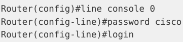
+ 為控制台新增一個本機使用者名稱和口令組合   
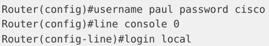 

+ 為控制台（以及虛擬終端）線路建立一個超時值，如此就可以在間過後斷開連接。  
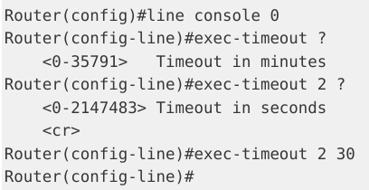  

# 遠程登陸訪問，Telnet Access    
>在給遠端登陸或說虛擬終端線路添加了口令之前，你實際上是不能**遠端登陸**進一台路由器的。  
>你可以為虛擬終端線路新增一個口令，或是告訴路由器去尋找一個本機使用者名稱及口令組合   

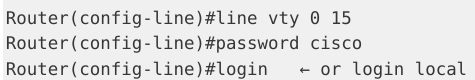  
下面的輸出是自某台路由器到另一台的遠端登陸會話。遠端登入後前面主機名有改變(變Router2)
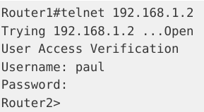  
+ 安全版 IOS 镜像  
>將路由器配置為僅允許**安全殼訪問**，而不是遠端登陸訪問。  

好處:數據都加密了  
啟用安全殼後，再次使用遠端登時，連線將被終止。  
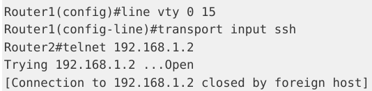  
 

# 啟用模式保護，Protecting Enable Mode  
>enable mode 取得路由器的設定訪問，因此你會想要保護該模式，所以可以設密碼  

可配置一個使能秘密（an enable secret **有MD5加密**） or 使能口令（an enable password **未加密的**）。  
(不建議同時都設有)  
+ 使能秘密較新IOS版本還能改SHA256加密  
+ enable password cisco  配置一個使能秘密  
+ enable secret cisco    配置一個使能口令
+ `service password-encryption`設定較低版本的加密

### 如果忘記password使能口令:  
>採用口令恢復操作，型號不同其口令恢復過程也不一樣。  

# 使用者存取防護，Protecting User Access  
>思科 IOS 提供使用者單獨的使用者名稱及口令，同時對所能夠使用的指令進行清單限制的能力。  
+ 可在路由器上指派不同使用者帳號的存取等級    
+ 思科路由器有口令安全的兩種模式，使用者模式（Exec mode）和特權模式（Enable mode）。  

ex:`privilege exec level 4 ping`把ping指令的執行權限改成四級  
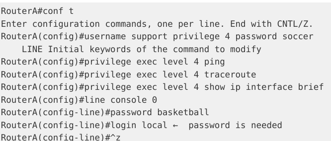  
+ `line console 0`進入控制台線路配置模式， 0 是唯一的控制台線路編號。 
+ `username support privilege 4 password soccer`在路由器上創建一個用戶名為 support 的用戶，  
並賦予該用戶 4 級的權限且設置該用戶的密碼為 soccer。 

如此一來如果該用戶(support)輸入了(如conf t)就無法執行，因為沒被允許   
`show privilege`查看當前默認得權限級別  
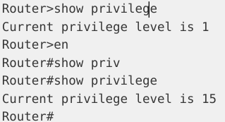    

# 更新 IOS， updating the IOS   
好處:  
+ 修正已知的**軟體缺陷**，fixed known bugs
+ 解決**安全隱患**，cloese security vulnerabilities
+ 提供**特性強化**及 **IOS 能力**提升，Offers enhanced features and IOS capabilities  

# 路由器日誌記錄，Router Logging  
>日誌訊息通常會在你經由控制台進入到路由器時，顯示在螢幕上。  
有**8個**可用的日誌記錄嚴重程度等級<MARK>（考試要求你知道這些**不同的等級**）</MARK>  

+ emergencies—System is unusable -----------------(severity=0)    
+ alerts—Immediate action needed ------------------(severity=1)  
+ critical—Critical conditions -------------------------(severity=2)  
+ errors—Error conditions ----------------------------(severity=3)  
+ warnings—Warning conditions ---------------------(severity=4)   
+ notifications—Normal but significant conditions ---(severity=5) 
+ informational—Informational messages ------------(severity=6)       
+ debugging—Debugging messages -----------------(severity=7)    

### 指令:
+ `no logging console`  關閉日誌訊息輸出  
+ `logging synchronous` 設定為無中斷（not interrupt），  
會重新輸入在被日誌訊息中斷之前，你所輸入的那行指令  

但如果經由 Telnet (或 SSH) 進入到路由器時，你是不會看到控制台輸出的。  
執行 `terminal monitor`指令即可看到  

# 簡單網路管理協議，簡單網路管理協議，SNMP  
>SNMP 是一種可用於**遠端管理網路**的服務。

>它由一台網路管理員維護、運作了 SNMP 管理軟體的中心工作站，及包括路由器、交換器及伺服器等的，  
各台網路設備上的小檔案（代理，agents）所構成。 

運用 SNMP， 你可以遠端地設定或是關閉連接埠和設備。  
你也可以將其配置在某些條件觸發時，諸如出現高頻寬或是連接埠宕掉時，發出警告訊息  
# 加固交换机，Securing the Switch  
## 阻止遠端登陸訪問，Prevent Telnet Access  
>以明文方式發送口令，這就是說，可輕易地在**配置中讀取**口令  
或是有人接到你的網路上，那麼就能透過**網路嗅探軟體**查看到口令。  

#### 想要有對管理埠的遠端存取: 
`transport input ssh`  開啟到交換器的 SSH 通信，前面有提過了。(默認遠端登入是關閉的)  

## 開啟SSH， Enable SSH  
>盡可能地採用 SSH 而不是 Telnet 和 SNMP 來存取你的交換器。  

+ SSH 採用公鑰加密法（pubic-key cryptography）來認證連接裝置。    

+ Telnet 及SNMP版本1 和2 都是未加密的，易受包嗅探（packet sniffing）的影響    

+ SNMP 版本3 提供了保密性-- 封包有加密以防止惡意來源竊取資料。  

要開啟 SSH， 你需要有一個支援加密的 IOS 版本。  

指令
 `show version`    ---找出 IOS 鏡像是否支援加密(尋找鏡像檔名中有無 <MARK>k9</MARK> 字樣)  

> ***注意:*** 如你沒有有安全特性版本的 IOS，你就必須為此付費購買。  

在連線時，你這邊使用公鑰加密數據，交換器將會使用它的私鑰來解密資料。  
在建立公鑰/私鑰對時，會使用到主機名稱.網域命名法（hostname.domainname nomenclature）  
所以在命名主機名稱和網域名稱時，將其命名為能夠代表系統的有意義名字，是好的做法。  

1. 你要給交換器一個與預設主機名稱 Switch 不一樣的主機名稱。  
2. 加入其域名     -----(ex: `ip domain-name mydomain.com`)
3. 係數/模量（the modulus） 是指你所希望使用的密鑰的長度，取值範圍是<MARK> 360</MARK> 到 <MARK>2048</MARK>, 後者俱有最高的安全性；  
(高於 1024 位的模量就認為是安全的了)。-----------(ex: `crypto key generate rsa`)
4. 交換器上的 SSH 就開啟了   
 

### SSH 相關的維護命令  
+ `ip ssh time-out 60` 指令會將任何空閒 60 秒的 SSH 連線置為**逾時**。  
+ `ip ssh authentication-retries 2` 則會在認證失敗兩次的 SSH 連線**重設為初始狀態**  
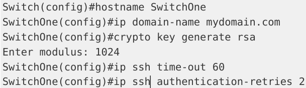

`show ip ssh`  驗證交換器上的 SSH 開啟  

## 設定啟用秘密口令，Set an Enable Secret Password  
>務必設置一個口令或秘密口令來保護全局配置模式   

`enable secret` 口令則會進行加密  
前面有提到不要同時設定使能口令（a password）和使能秘密口令（enable secret password）,會帶來混亂。  
<MARK>所以請只設定使能秘密口令就好。</MARK>     
`service password-encryption`  對使能口令 enable password 進行 7 級加密  
在命令前鍵入 `do` 關鍵字，而**無需回到特權模式**，就可執行該命令  

下面的秘密口令（the secret password）則有著強加密（MD5）。
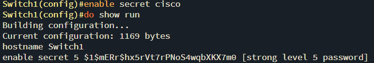  

## 修改原生 VLAN， Change the Native VLAN
>交換器使用原生VLAN 來承載那些特定的協定流量，  
諸如思科發現協定（Cisco Discovery Protocol, CDP）、 VTP、連接埠聚合協定（Port Aggregation Protocol, PAgP），以及DTP等協定資訊。  
預設原生 VLAN 總是 VLAN 1   

將端口放入 VLAN 1 被視為一種安全漏洞（a security vulnerability）, 允許駭客取得網路資源的存取。  
為減輕此問題，**避免任何主機放入 VLAN 1**是一種明智可取的做法(ex: switchport trunk native vlan 888)    

`switchport trunk allowed vlan remove 888`  阻止原生 VLAN 上的資料通過中繼連結    

## 修改管理VLAN , Change the Management VLAN  
>為交換器配置 IP 位址，以實現為管理目的而遠端登陸到其上，也是可以的。  
這又叫做交換器虛擬介面（Switch Virtual Interface, SVI）  
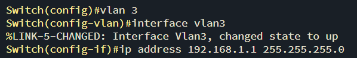

## 關閉CDP, Turn Off CDP  
>思科發現協定（Cisco Discovery Protocol, CDP）  
在大多數的路由器和交換器上的每個介面下，該協定都是開啟的，這也是通行的做法，其功能是發現路由器或交換器上連接的思科設備  

在那些你的網路邊緣上的，連接其它公司或 ISP 的那些設備上關閉 CDP。   
+ `show cdp neighbor detail`查看附近設備資訊  
+ `no cdp run` 	關閉整個設備的CDP  
+ `no cdp enable`  對某個特定接口關閉 CDP  
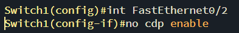  

## 添加横幅消息，Add a Banner Message  (不太懂 感覺很沒用)
>於某用戶登入路由器或交換器時顯示出來，會顯示你設定的警告訊息。  

橫幅訊息可以是以下這些。   
+ 在使用者看到登陸提示符號之前顯示出來 -- MOTD（message of the day）   
+ 在使用者看到登陸提示符號之前顯示出來 -- Login   
+ 在登陸提示符號之後顯示給使用者 -- Exec （在你打算對未授權使用者隱藏的資訊）

 
 
  
 
### 設置VTP 口令， Set a VTP Password  
`vtp domain 60days`  
`vtp password cisco`
### 限定VLAN 信息， Restrict VLAN Infaomation   
>指定 VLANs 才能通過中繼連結   

`int FastEthernet0/4`  
`switchport mode trunk`  
`switchport trunk allowed vlan 7-12`  
`show interface trunk`  

## 連接埠因出錯而關閉後的恢復功能，Error Disable Recovery  
>思科交換器將其連接埠置為一種特別的關閉模式（a special diabled mode）, 叫錯誤關閉（err-disabled）。  
在某個特定連接埠上發生某種錯誤後，該連接埠就被關閉  

+ EX:某個未授權使用者嘗試連線到某個交換器連接埠時，它阻止那些違規設備存取網路。  

而為了重新使用某個出錯關閉接口，以在該接口上執行 `shutdown` 及 `no shutdown` 命令的人工干預是必要的,   
網路工程師們俗稱此操作為**端口彈跳(a bouncing the port)**。  

### 但需要自動恢復而不是等管理員就要:  
`errdisable recovery cause`  
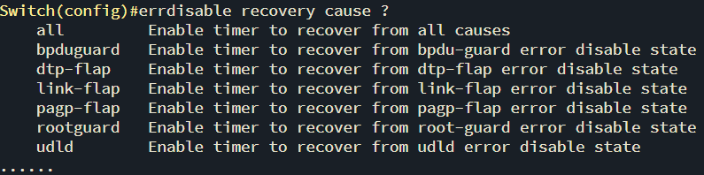  

自動恢復的預設時間是 300 秒，此時間可以用全域設定指令 `errdisable recovery interval` 手動修改。
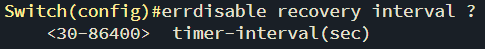  

`show errdisable recovery` 命令則會提供有關出錯關閉恢復功能（the err-disable recovery function）  
激活了的那些特性的細節信息，以及受到監測的接口，並包含了接口重新開啟剩餘時間。  

## 外部認證方式，External Authentication Methods
>與本地儲存不同，你可以採用一台通常運行了AAA 或 TACACS+ 的**伺服器來儲存**使用者名稱和口令。  
這麼做的優點在於，你無需在每台路由器和交換器上都手動輸入使用者名稱和口令。  
而是將其儲存在**伺服器的資料庫**中。

 ####  TACACS+   
 >表示「加強版終端機存取控制器存取控制系統」。   

 它是一個**思科專有協議**，使用 **TCP 49** 號連接埠。   
 TACACS+ 提供了經由一台或多台 TACACS+ 中心伺服器，對包含路由器及網路介入伺服器等**網路設備的存取控制**。  

 ####  RADIUS  
 >撥入用戶遠端認證服務 **RADIUS**, 是一套**分散式網路安全系統**，**開放標準**  

 以確保網路**遠端存取的安全性**，同時它又是一個使用**UDP** 的客戶端/伺服器協定。   
 

 ####  AAA  
 >開啟認證、授權和記帳（Authentication, Authorization, and Accounting, AAA）。  

 安裝在一台伺服器上的，它監控網路的一個使用者帳號資料庫。使用者存取、協定、連接，以及斷開原因，及其它許多特性都能被監控到。

## 路由器時鐘及 NTP， Router Clock and NTP  
>當你遇到安全入侵（security violations）、SNMP 問題（SNMP traps）, 或事件記錄時，會用到時間戳。  

`show clock`檢查時間

### 設定正確時間:  
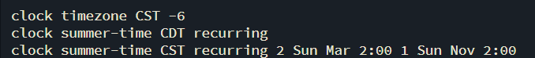  
 設置時區  

 除了手動設定時鐘外，你可以使用**網路時間協定（Network Time Protocol, NTP）**以保證非常精確的時間 

 + 它讓你可將交換器的時鐘與某台原子鐘（an atomic clock）同步

 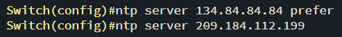  

 查看時鐘是否已經和 NTP 來源保持同步  
   

 # 關閉未使用的那些端口，Shut Down Unused Ports  
 >不關閉未使用端口的話可能導致一些安全問題，包括。   
 + 網路未能如同與其的那樣運作   
 + 網路資訊暴露於外部人員  

 關閉連接埠是透過在介面設定模式下使用 shutdown 命令完成的  
 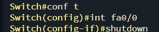  
 驗證某連接埠處於關閉狀態有多種方法，其一就是使用 `show ip interface brief` 指令。  

 # 思科發現協議， Cisco Discovery Protocol, CDP
 <MARK>熱門考點</MARK>
>**思科專有協議**，它是一種**二層服務**, 設備用它來通告和接收那些直接連接設備的**基本訊息**，   
並<MARK>**不需要配置有 IP 位址**</MARK>來交換資訊。只需開啟介面就行。如有設定 IP 位址，該 IP 位址也會包含進 CDP 訊息中。  

`show cdp neighbors detail`
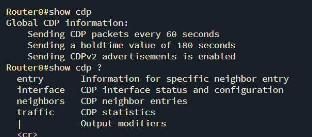  

# 交換機端口安全，Switch Port Security  
>連接埠安全特性，是透過限制某個特定連接埠或是介面能夠學習到的 **MAC 位址數目**，來保護交換器連接埠安全，  
具備了端口安全特性，交換器就能夠維護一張用於明確哪個 MAC 位址（或哪些位址）、可以存取哪些本機交換器連接埠的表格  
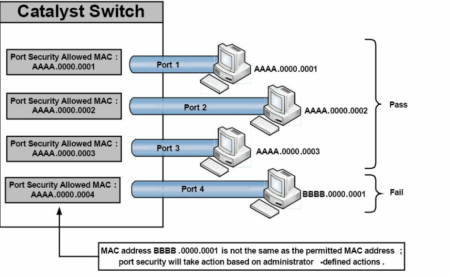  
在連接埠4 上所配置的是允許 AAAA.0000.0004 MAC 位址，但所接取的 MAC 位址卻是 BBBB.0000.0001。  
因為主機 MAC 位址與所允許的 MAC 不一樣，連接埠安全性（port security）將在連接埠上做出如同管理員所設定的適當動作  
+ 這些有效連接埠安全動作將在接下來的部分詳細說明。  

連接埠安全特性設計用於保護交換區域網路（the switched LAN）免受兩種主要的攻擊方式。這兩種方式在下的小節就講到。   
+ CAM 表格溢位攻擊， CAM table overflow attacks   
+ MAC 欺騙攻擊， MAC spoofing attacks  

## CAM 表格(MAC 地址表)溢位攻擊  
>交換器的 CAM 表包含了實體連接埠上的那些 MAC 位址，及其 VLAN 參數。  
`show mac-address-table dynamic`  查看MAC 地址表    

>交換器的儲存資源是有限的。這就意味著 CAM 表的儲存空間是固定的，已分配好的。  
+ CAM 表溢位攻擊（CAM table overflow attacks）將此限製作為目標。

以大量的無效來源及目的 MAC 位址灌入交換機，填滿 CAM 表，此時交換器就無法接收新的 CAM 表條目了
在此情況下，**交換器成為了一台集線器**，只能開始簡單地將新進接收的訊框廣播到其上的所有介面（**同一 VLAN 中的**），  
就是將該 VLAN 變成了一個大的**廣播域**。

#### 解決方法:  
**增加 VLANs 的數目**（此舉減少了廣播域的尺寸），可有助於降低 CAM 表攻擊的影響，  
在交換器上**配置連接埠安全特性**，是建議的安全方案。  

## MAC 欺騙攻擊，MAC Spoofing Attacks  
>MAC 位址欺騙，用於冒充某個來源 MAC 位址，以達到扮演網路上的其它主機或裝置的目的    

主要目的是擾亂交換機，令到其以為某台同一主機連接到兩個連接埠上，這就導致交換器嘗試同時將訊框轉送給受信任的主機和攻擊者  
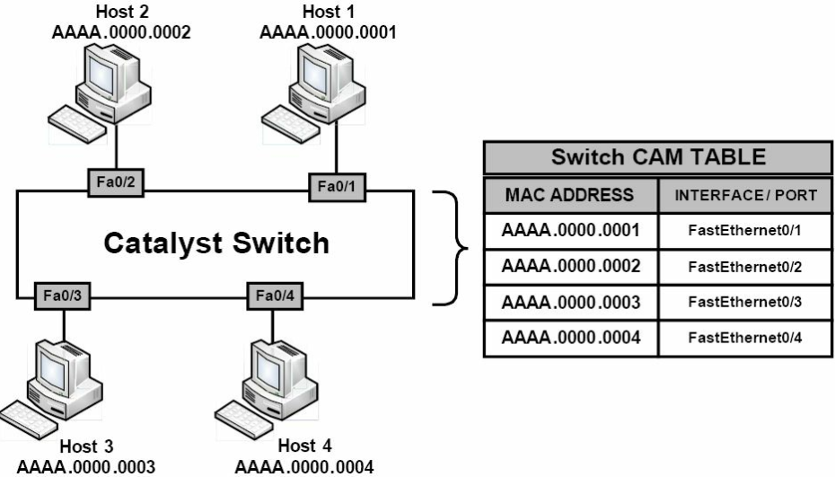  

現在，假設 1 號主機被某個想要接收所有發送到 2 號主機流量的攻擊者入侵了。  
則經由 MAC 位址欺騙，攻擊者精心建構出使用 2 號主機來源位址的乙太網路封包。  
在交換器收到該幀後，它會記下該來源位址，並重寫CAM 表中2 號主機所對應的條目，  
將其指向FastEthernet 0/1 端口，而不是2 號主機所真正連接的FastEthernet 0/ 2。  

+ 此外，這也將擾亂交換機，造成重複的重寫 MAC 位址表條目，引發在合法主機（也就是 2 號主機）上的拒絕服務攻擊DoS。  
+ 而假如仿冒的 MAC 位址數目很高，MAC 位址欺騙攻擊也將持續重寫對其 CAM 表的交換器的效能造成嚴重影響。  

#### 解決方法:  
應用連接埠安全性(implementing port security)，可以減輕 MAC 位址欺騙攻擊的影響。  

## 地址安全的端口安全，Port Security Secure Addresses  
>經由連接埠安全特性，我們可以指定特定 MAC 才被允許存取某個**交換器端口**，  
同時限制某個單一交換器端口所支援的 **MAC 位址數目**。   

+ 靜態 MAC 位址保全, Static secure MAC addresses   
+ 動態 MAC 位址保全, Dynamic secure MAC addresses   
+ 黏滯 MAC 位址保全, Sticky secure MAC addresses  

#### 靜態 MAC 位址保全
>由網路管理員靜態配置，並儲存在 MAC 位址表中，同時也保存在交換器設定檔中。  

指派給安全端口時，交換機不會轉發與靜態安全MAC地址不匹配的幀

#### 動態 MAC 位址保全  
>是交換器所學習到的，儲存在 MAC 位址表中  

要交換機斷電或重啟，動態安全 MAC 位址項目會從交換器移除  
在交換器再次啟動時，這些位址就要重新習得
#### 黏滯 MAC 位址保全  
>是靜態和動態 MAC 位址保全的結合。  

位址可動態習得，也可靜態配置，儲存在 MAC 位址表中，也保存在交換器設定檔裡，   
所以在重啟斷電後不用重新習得  

## 動作的連接埠安全，Port Security Actions  
>一旦開啟了連接埠安全，管理員就可定義出在出現違反連接埠安全事件後，交換器所採取的動作了。  

以下是 4 種在出現衝突時所採取的不同動作。  
+ 保護，Protect   
+ 關閉（預設動作）, Shutdown(default)   
+ 限制，Restrict   
+ 關閉 VLAN （超出 CCNA 大綱）, Shutdown VLAN(outside of the CCNA syllabus)  

### 保護動作選項 
>**強制連接埠進入受保護連接埠模式（Protected Port mode）**  
此模式下，交換機會簡單地丟棄所有來源位址不明的單播和多播幀  

交換機以受保護連接埠模式運作時，不會發出通知  
+ 所以此模式下的交換器連接埠阻止所有流量時，管理員是無法獲知的。  

### 關閉動作選項  
>**違反連接埠安全後，將某連接埠置於某種錯誤關閉狀態**

用到時交換器上對應連接埠的 LED 同時被關閉  

關閉模式下，交換器發出 SNMP trap, 以及一則 syslog 訊息，  同時衝突計數器會增大  
 

### 限制動作選項 
>**安全 MAC 位址數目到達管理員為該連接埠所定義的最大限制時，用於丟棄那些具有不明 MAC 位址的封包。**  

此模式下，交換機會持續限制額外的那些 MAC 位址發出幀，直到移除對那些安全 MAC 位址數目的限制，或直到所允許的最大位址數目得以增加  

和關閉工作選項一樣，交換器也會發出 SNMP trap 及一則 syslog 訊息，同時衝突計數器會增加。  

### 關閉 VLAN 動作選項  
>**跟關閉動作選項類似；不過此選項是關閉某個 VLAN, 而不是某個交換器連接埠**  

可能會套用在那些指派了多個 VLAN， 諸如語音 VLAN 和資料 VLAN，的連接埠上，以及交換器的中繼連結上。  

## 端口安全配置， Configuring Port Security  
>在設定連接埠安全之前，建議將交換器連接埠靜態配置為二層存取連接埠  
（連接埠安全性只能設定為靜態存取連接埠或中繼連接埠上，無法設定在動態連接埠上）。  

預設情況下，連接埠安全是關閉的；但可透過接口設定指令      
+ `mac-address {mac-address}`	此關鍵字用於指定一個靜態保全 MAC 位址。你還可以**加入不超過配置的最大數目的其它安全 MAC 位址**。  
+ `vlan {vlan id}`	此關鍵字應只使用在某個中繼埠上，**以指定 VLAN ID 和 MAC 位址**。如沒有指定 VLAN ID，就使用原生 VLAN  
+ `vlan {access}`	此關鍵字應只用在某個存取連接埠上，以**指定該 VLAN 作為存取 VLAN**。  
+ `vlan {voice}`	此關鍵字應只用在某個存取埠上, 用**以知 VLAN 作為一個語音 VLAN**。而只有在該特定連接埠上配置了語音 VLAN 時，該選項才可用  
+ `mac-address {sticky} [mac-address]`	此此關鍵字用於在特定介面上**開啟動態或位址黏滯學習**，或為其**設定靜態安全 MAC 位址**。  
+ `maxium {value}`  此關鍵字用於指定某個介面上**可以學到的安全位址的最大數目**。預設是 1    

## 靜態安全地址配置， Configuring Static Secure MAC Addresses  

1. 下面的輸出示範如何在某個介面上**開啟連接埠安全**，以及在某個交換器存取連接埠上**設定一個靜態安全MAC位址** `001f:3c59:d63b`。
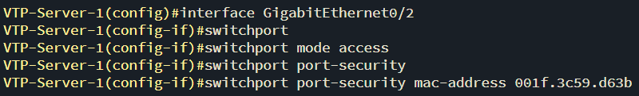  

2. 下面的輸出示範如何在某個介面上**開啟連接埠安全**，並在某個交換器中繼埠的 **VLAN 5 中設定一個靜態安全 MAC 位址** `001f:3c59:d63b`。
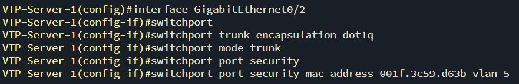    

3. 下面的輸出則示範如何在某個介面上**開啟連接埠安全**，並在某個交換器存取連接埠的**VLAN 5(資料VLAN) 和VLAN 7(語音VLAN)**，分別**設定一個靜態安全MAC 位址**`001f:3c59: 5555` 和`001f:3c59:7777`。
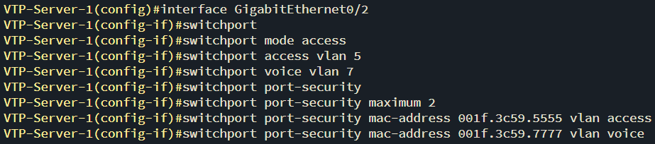  

`switchport port-security maxium 2` :設定最大允許安全位址數為 2  

##  靜態安全位址配置的驗證，Verifying Static Secure MAC Address Configuration
>透過執行 `show port-security` 指令，可以驗證全域連接埠安全性設定參數。  
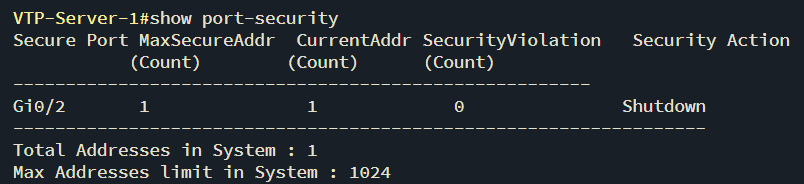  
預設情況下，每個連接埠上僅允許**一個安全 MAC 位址**，且出現衝突事件時的預設動作就是**關閉端口**  

經由執行 `show port-security interface [name]` 亦可確認同樣的參數  
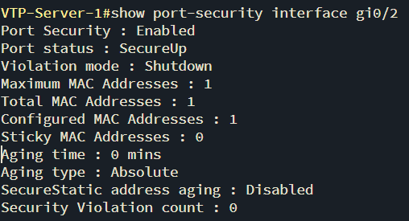  

檢視該連接埠上具體設定的靜態安全 MAC 位址，  
就要用到 `show port-security address` 或 `show running-config interface [name]`  
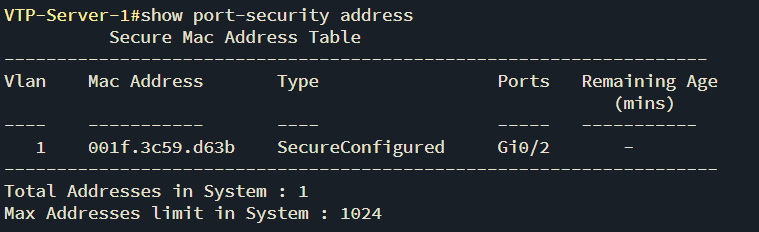  

## 動態安全 MAC 位址的配置，Configuring Dynamic Secure MAC Address  
要令到該連接埠學到不只一個 MAC 位址並將它們設為安全 MAC 位址，就要使用指令 `switchport port-security maxium [number]`。  
記住 `[number]` 關鍵字是依平台而定的，在不同的思科 Catalyst 交換器型號上會有所不同。   

選定適當的交換器資料庫（Switch Database Management, SDM）模板  
預設的 SDM 模板則是嘗試在各項特性間提供一種平衡。因此，會影響其它各項特性和功能的最大性能值。  
+ 一個例子就是在採行埠安全時，所能學到或設定上的安全 MAC 位址最大可能數會減少。  

下面將接口GigabitEthernet0/2,配置為動態學習並將至多兩個 MAC 位址設為安全 MAC 位址  
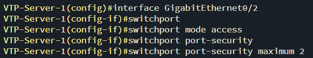  

## 驗證動態 MAC 位址保全，Verifying Dynamic Secure MAC Addressed  
可用除了 `show running-config` 指令外的`show port-security address` 秀出一個配置為動態 MAC 位址保全學習的接口  

## 設定保全 MAC 位址黏滯，Configuring Sticky Secure MAC Addresses  
在某個連接埠上設定動態黏滯學習，以及限制連接埠學習到至多 10 個的 MAC 位址  
`switchport port-security mac-address sticky`  
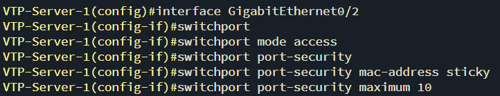  

`show running-config interface GigabitEthernet0/2`顯示了介面 GigabitEthernet0/2 上所自動學到的 MAC 位址  
上面輸出中粗體的 MAC 位址都是動態學到的，而且被加入到目前設定檔中了。而無需管理員手動配置來將這些地址加入到設定文件  

要確認此資訊已儲存到 **NVRAM** 中，也就是這些位址不要在交換器重新啟動後重新學習，就要記住執行 `copy running-config startup-config`指令

## 配置端口安全衝突的動作， Configuring the Port Security Violation Action  
>前面有提到出現衝突時可採取的 4 種不同動作  
+ 保護動作，Protect   
+ 連接埠關閉動作（預設），Shutdown(default)   
+ 限制動作，Restrict    
+ 關閉 VLAN 動作（CCNA 大綱不要求），Shutdown VLAN   
  
`switchport port-security [violation {protect | restrict | shutdown | shutdown vlan}]` 來設定這些選項  

如果某個連接埠因為一個安全衝突而關閉，它就顯示為 errdisabled，  
此時需要使用 `shutdown` 和接著的 `no shutdown`指令來將其再度開啟。  

### 思科要求你知道何種衝突動作引起發出給網路管理員一條 SNMP 訊息以及產生一條日誌訊息  
<mark>下面的表 4.2 是你所要的資訊。</mark>

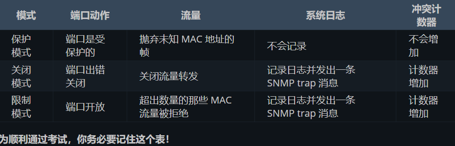  

`switchport port-security violation restrict`  交換機會丟棄來自違規 MAC 位址的封包，並增加安全違規計數器，但不會關閉連接埠  

## 對連接埠安全衝突動作的驗證，Verifying the Port Security Violation Action  
>是透過指令 `show port-security` 指令，來對所設定的連接埠安全衝突動作進行驗證的  

如交換器上開啟了日誌記錄，同時配置了限制模式（Restrict mode）或關閉模式（Shutdown mode），類似於下面輸出的這些訊息將會在控制台列印出來，  
並記錄到本地快取或發送到某台日誌伺服器。  
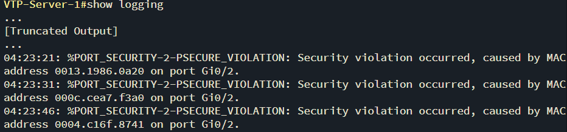    

#　問題　　
　　
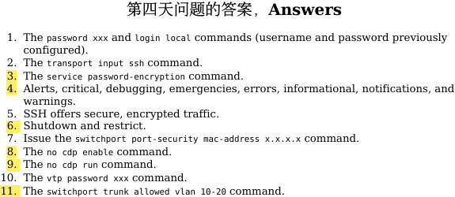　　

 
