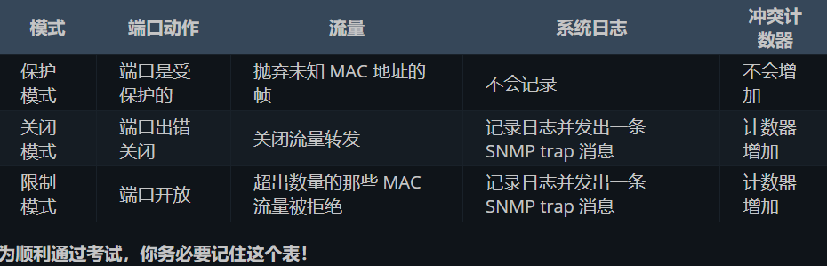

日誌訊息通常會在你經由控制台進入到路由器時，顯示在螢幕上。  
有**8個**可用的日誌記錄嚴重程度等級<MARK>（考試要求你知道這些**不同的等級**）</MARK>  

+ emergencies—System is unusable -----------------(severity=0)    
+ alerts—Immediate action needed ------------------(severity=1)  
+ critical—Critical conditions -------------------------(severity=2)  
+ errors—Error conditions ----------------------------(severity=3)  
+ warnings—Warning conditions ---------------------(severity=4)   
+ notifications—Normal but significant conditions ---(severity=5) 
+ informational—Informational messages ------------(severity=6)       
+ debugging—Debugging messages -----------------(severity=7)     

思科要求你知道何種衝突動作引起發出給網路管理員一條 SNMP 訊息以及產生一條日誌訊息  
<mark>下面的表 4.2 是你所要的資訊。</mark>

  

## 本次使用指令:  
line console 0		進入控制台線路配置模式  
username support privilege 4 password soccer	在路由器上創建一個用戶名為 support 的用戶，並賦予該用戶 4 級的權限且設置該用戶的密碼為 soccer。  
show privilege		查看當前默認得權限級別  
no logging console        關閉日誌訊息輸出  
logging synchronous      設定為無中斷（not interrupt），會重新輸入在被日誌訊息中斷之前，你所輸入的那行指令  
transport input ssh      開啟到交換器的 SSH 通信  
ip domain-name mydomain.com	加入其域名   
crypto key generate rsa       	希望使用的密鑰的長度  
ip ssh time-out 60 		指令會將任何空閒 60 秒的 SSH 連線置為逾時。  
ip ssh authentication-retries 2 則會在認證失敗兩次的 SSH 連線重設為初始狀態  
show ip ssh 		驗證交換器上的 SSH 開啟  
enable secret 		使能秘密口令進行加密  
service password-encryption  對使能口令 enable password 進行 7 級加密    
switchport trunk native vlan 888  原生 VLAN 修改为某个未使用的 VLAN。  
switchport trunk allowed vlan remove 888   阻止原生 VLAN 上的資料通過中繼連結  
show cdp neighbor detail	查看附近設備資訊  
no cdp run 	關閉整個設備的CDP   
no cdp enable  	對某個特定接口關閉 CDP  
show cdp neighbors detail  
show errdisable recovery  
show clock	撿查一下它的时间  
show mac-address-table dynamic  
switchport port-security  	开启端口安全  
switchport access vlan 5  
switchport port-security maxium 2  		最大允許安全位址數應設定為 2  
switchport port-security mac-address 001f.3c59.5555 [vlan access] 	配置一个静态安全 MAC 地址 001f:3c59:5555到vlan 5。  
show port-security	驗證全域連接埠安全性設定參數。  
show port-security interface [name]
switchport port-security mac-address sticky  在某个端口上配置动态粘滞学习  
copy running-config startup-config	此資訊儲存到NVRAM 中  
switchport port-security violation restrict		交换机会丢弃来自违规 MAC 地址的数据包，并增加安全违规计数器，但不会关闭端口。  
 
