#  Day2_CSMA/CD, 交換與虛擬區域網
## 本次用到指令  

show mac-address-table (查看 table)  
show version  
show vlan  
interface vlan1 
ip add 192.168.1.3 255.255.255.0  (给 VLAN 配置 IP 地址)  
no shutdown  
show interface vlan1  
ip default-gateway 192.168.1.1   (告诉交换机往哪还需告诉交换机往哪里发送所有里发送所有IP流量，因为2层交换机没有建立路由表的能力)  
line vty 0  (開啟協議)  
password cisco  
login  
transport input ssh  (允許 SSH 連線進入交換機，這就是說流量會被加密。  
switchport 告诉交换机将其某个端口作为二层端口，而不是三层。)   

## CSMA/CD  （載波偵測多重存取/碰撞偵測）運作過程如下：

1. 訊號採用廣播的方式傳送 ------ （所以才會發生碰撞）  
2. 當節點要發送訊號時，會先偵測通道是否有其他節點正在使用（carrier sense）  
3. 當通道沒被使用，就傳送封包  
4. 封包傳送後立即檢查是否發生碰撞（carrier detection），若是發生碰撞則對通道發出 **壅塞訊號** 告知其他節點發生碰撞  
5. 碰撞後隨機等待一段時間重新發送封包  
6. 嘗試 15 次都失敗的話則告知上層 Timeout  
 

現代switch使用的是**全雙工連接交換機**，因此不會使用到 CSMA/CD。  
然而**半雙工模式**則需要使用，半雙工典型設備為Hub。 
 
詳細資料: 
[解析全双工、半双工与CSMA/CD的关系，CSMA/CD在现在的交换式以太网下还用吗？](https://blog.csdn.net/weixin_38023259/article/details/105397905)

## 衝突域與廣播域
現代switch的優點之一就是switch的每個連接埠都是作為一個衝突域(collision domain)。   
廣播域就是指網路中所有能接收到**同樣**廣播訊息的設備的集合

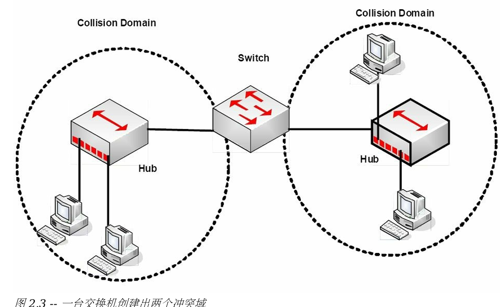
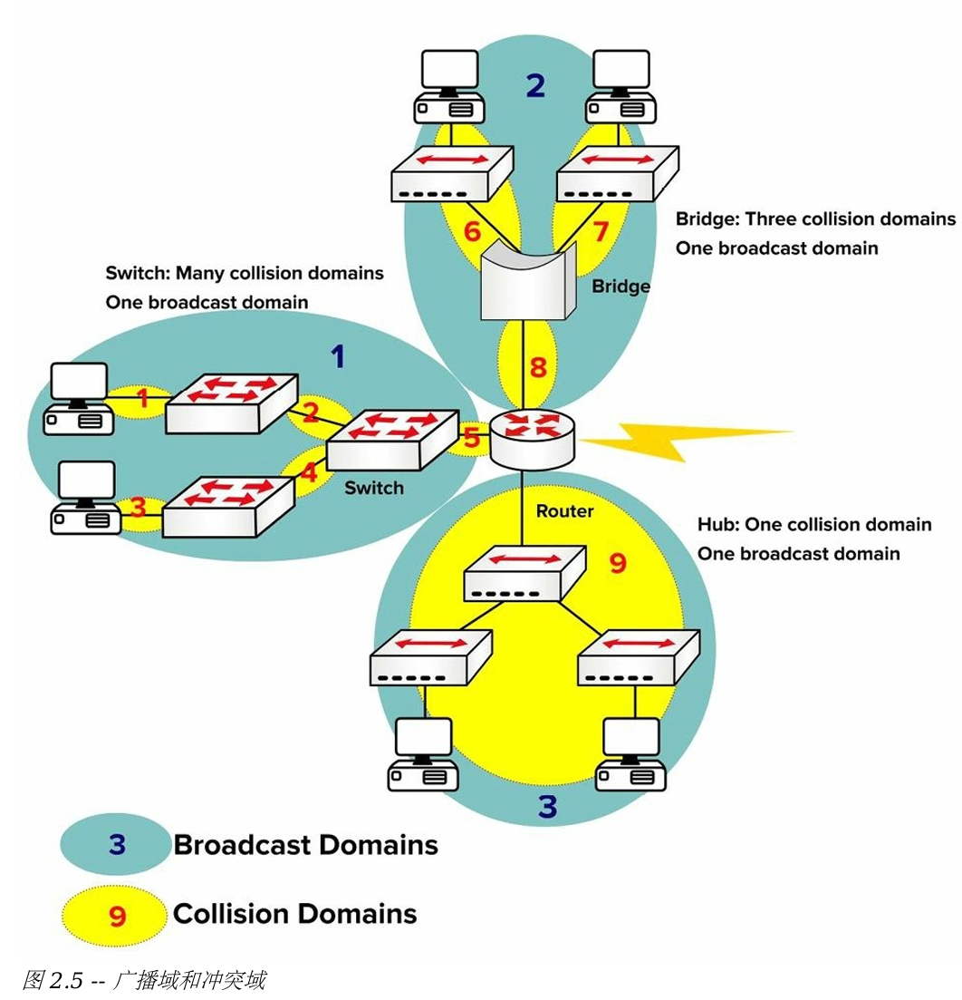

## 自動協商 Auto-negotiation
>此技術讓設備在傳輸流量前，就雙工和速率上達成一致。  

auto-negotiation 仍可能会引起问题 (當網卡或廠商交換機與 IEEE 802.3u 規範不完全一致時，問題就會發生。)  

### 設定端口速率    
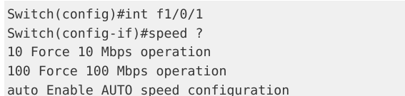

## Switching Frames  
>交換器是為交換訊框而生（也就是說，將來自某進入介面的訊框傳送到正確的出口介面）  
1. 據目的 MAC 位址，進行幀轉送或過濾(forwarding or filtering)   
2. 從進來的幀學習 MAC 位址   
3. 使用 STP 協定來阻止二層環回的發生（STP 在第31天學習）

#### 如目的地址不在 MAC 地址表中，  
交換器將該訊框泛洪(flooding)到除了它接收的該接口以外的所有接口上。 

**交換器也會儲存那些連接在另一台交換器上的設備的 MAC 位址**   
(不過在位址表中它們對應的接口名稱會是同一個)
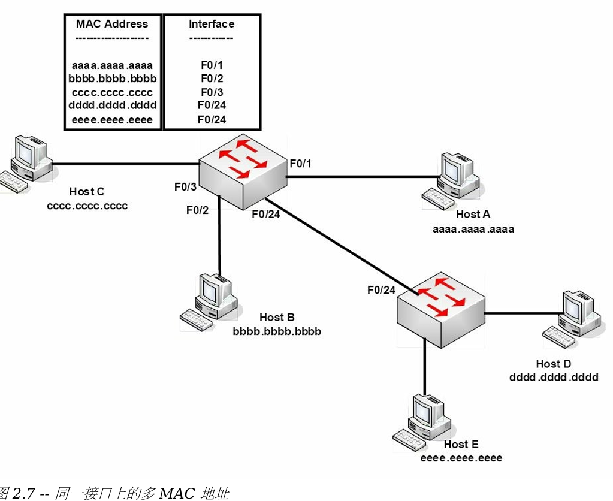

### 三種流量交換的方式  

+ 直通模式，Cut-through 
+ 儲存轉送模式，Store-and-forward （交換器預設）
+ Fragment-free（改進的直通模式）  

#### 直通模式
>優點:最快的交換方式,最低延遲  
缺點:Switch 會轉發錯誤的Frame  

一讀到目的地址，對照table後,就直接轉發

#### 存儲轉發模式  
>最高延遲 , 2900系列switch默認交換方式

1. 讀取整個Frame,並複製到他的緩衝區。  
2. 並對該Frame 執行一次循環冗餘校驗(cyclic redundancy check, CRC)，以檢查錯誤  
3. 發現錯誤，丟棄該Frame **or** 檢查table轉發

+ 存儲轉發模式 確保Frame至少有64bytes,且小於1518 bytes ，不符合就丟掉  
 

+ Ex:   
你是夜店保安，此時你必須確保照片與那個人是相吻合的，  
同時你在放進那些人之前要先記下他們的名字和地址。  
但這樣來查驗出入卡就造成了相當大的延遲。

#### Fragment-free( 修訂的直通模/Runt-free 模式)
>介於前兩這之間,快又可靠  
檢查前64bytes有無錯誤 (Frame的錯誤最可能發生在前64bytes)  
Runt侏儒幀(小於64bytes的Frame)會消除,所以也叫Runt-free

+ Ex: 夜店保全的例子，設想你被要求確保每個人都有出入卡同時照片又要吻合。   
在這個方式下，你確保每個人都是其宣稱的那個人，**但你不必記下**他們的所有資訊。

 

## 交換基本概念

### ***超重要!!!!!***  
`show mac-address-table`      考試、工作常用  
查看 table

## Ethernet Frame
有四種不同類型的乙太網路Frame：  
+ Ethernet 802.3 幀 -------------------不能識別上層協議,802.2類型幀 才具備
+ Ethernet II 幀 -----------------------不能識別上層協議
+ Ethernet 802.2 SAP 幀 
+ Ethernet 802.2 SNAP 幀  

### 802.3 幀結構  

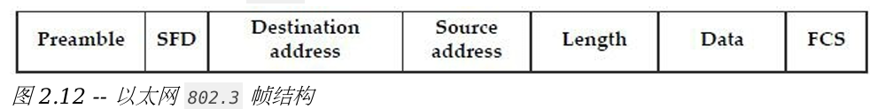

+ 前同步訊號， `preamble`  -- 為傳入的資料對網路卡進行訊號同步及告知  
+ 幀開始界定符， `start-of-frame delimiter`, SFD -- 標誌著幀的開始  
+ 目的位址 -- 目的 MAC 位址，可以是單播（Unicast）、廣播或多重廣播(Multicast)  
+ 來源位址 -- 發送主機的 MAC 位址  
+ 長度 -- 定義訊框中資料欄位的長度  
+ 資料 -- 訊框中的載重（就是傳輸中的資料）  
+ 幀校驗序列，frame-check sequence,FCS -- 給出了幀中所有資料的循環冗餘校驗（cyclic redundancy check, CRC） 

## 初始配置 Switch

`show	version`   
`show vlan`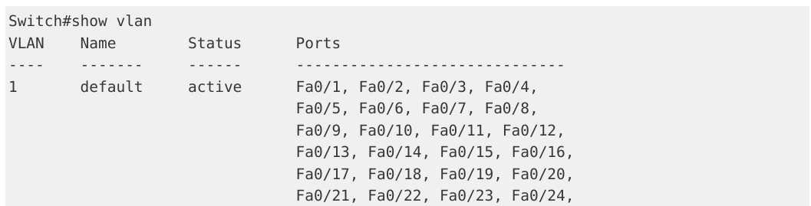 
+ 如果你打算為交換器新增一個 IP 位址（就是管理位址），以便透過網路連接到該交換機，只需給某個 VLAN 配置 IP 位址即可；本例中就是 VLAN1。 
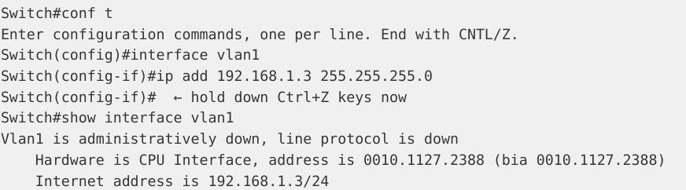 
+ VLAN1 預設是關閉的，你需要執行一個 `no shutdown` 指令來開啟它  
+ 還需告訴交換器往哪裡還需告訴交換器往哪裡發送所有里發送所有 IP 流量，  
因為 2 層交換器沒有建立路由表的能力
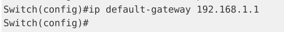  

如你要經由網路Telnet (或 SSH)到某台交換機，你還需開啟該協定。  
switch遠端存取預設是關閉的。
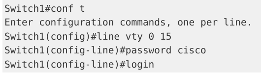

## VTYs（Virtual TeletYpe terminal）  
>是路由器或交換器用於對其進行 Telnet 或安全 Telnet (SSH) 存取的虛擬連接埠。  
預設為關閉  

你可以看到 0 到 4 埠、inclusive(包含)或 0 到 15 port。
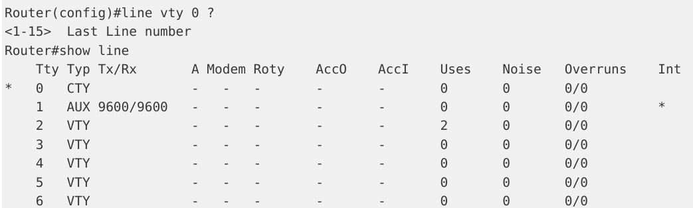  

 + CTY:控制台線路  
 + VTY:用於Telnet連接  
 + AUX:輔助端口  　
### 安全訪問:
>僅允許 SSH 連線進入交換機，這就是說流量會被加密。

要允許IOS鏡像:  
Switch1(config-line)# `transport input ssh`  
完成後Telnet 流量就不再被允許傳入到	VTY	端口了。
 

## 虛擬區域網 Virtual Local Area Networks,	VLANs
>優點:  
+ 較小規模的設備組中的較少廣播包令到網絡更快   
+ 設備資源得以節省，因為它們只需處理少量的廣播包
+ 提升安全性，將裝置保留在特定組別的一個廣播網域中，例如開發部門或測試室就應該與生產部門的設備分開。  
+ 帶來在跨越任何尺度的地理位置上網路擴展的靈活性。

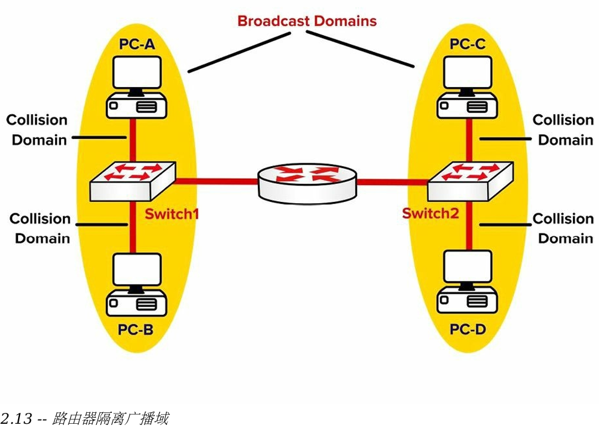
路由器打破了該廣播網域。  
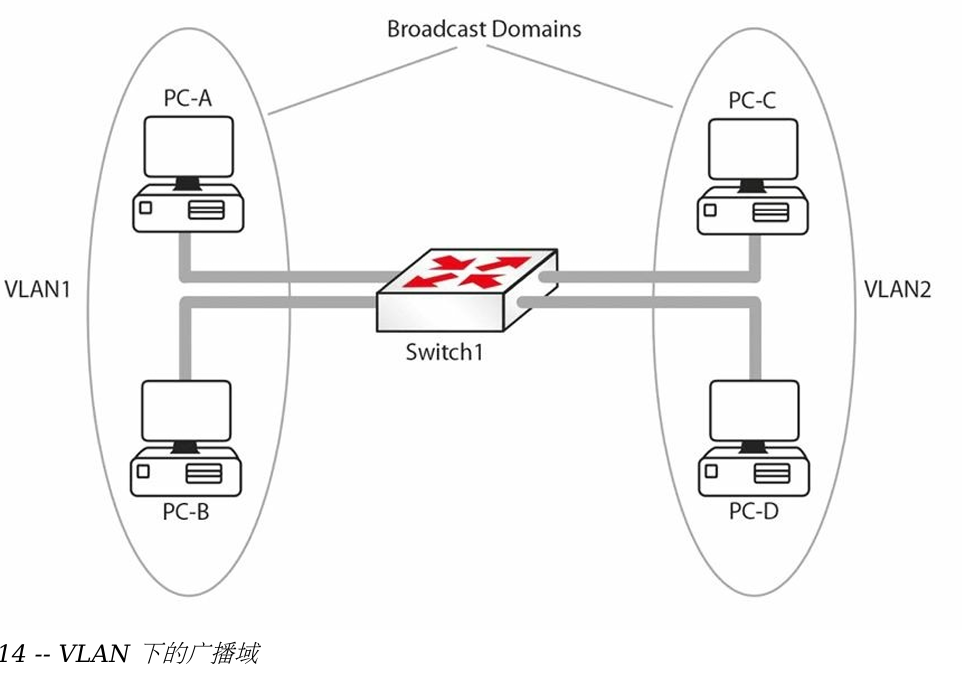
此 2 層網路經由 VLANs 被劃分為兩個廣播域。 PC-A 發出的廣播封包為 PC-B 接收到，PC-C 和 PC-D 接收不到。  
如沒有 VLANs，PC-C 和 PC-D 仍會收到 PC-A 發出的廣播包。
      
## VLAN標記，VLAN Marking
Cisco開發`ISL標準`是透過增加一個 26 位元組的頭部，  
以及一個新的 4 位元組尾部（trailer）來封裝原始Frame    

為解決兼容性問題IEEE開發了`802.Q標準`，用以建立可互通 VLANs。
ISL 和 802.1Q 是用來確保這些 VLANs 在穿過交換器中繼連結後，仍能完全分辨出來的兩種主要 方式。
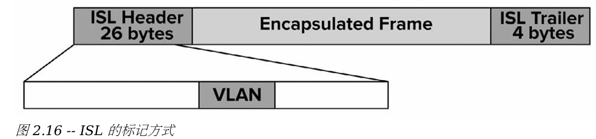
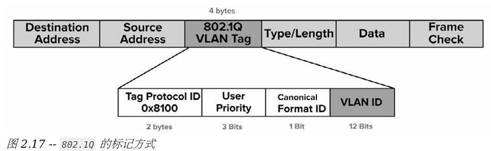

### 802.1Q:
+ 支援最多 `4096` 個 VLANs 
+ 且有`原生VLAN概念`
+ 採用幀內標記機制，修改原始幀
+ 由 IEEE 開發的標準協定
### ISL標準:
+ 支援最多 `1000` 個 VLANs

原生VLAN概念:  
預設情形下，802.1Q 中來自所有 VLANs的訊框都被打上標籤。  
此規則的唯一例外就是屬於原生 VLAN 的幀，這些幀未被標記。

[因此在某個特定中繼連結上，可以透過將某VLAN 設為原生VLAN，來指定其上面的訊框不打標籤]

## 加入虛擬區域網， VLAN Membership 
有兩種常用的將連接埠加入 VLANs 的方式 -- 靜態方式或動態方式。  
+ 靜態方式: VLAN 由系統管理員創建一一將交換機埠分配給VLAN。  
+ 動態方式: 動態指派方式令到設備可依其 MAC 位址而加入特定的 VLAN。
 
透過運用一台虛擬區域網路管理策略伺服器（a VlAN Management Policy Server, VMPS）實現動態特性。

### 因VLAN都是不同廣播域，有以下問題
+ 預設情形下，一個VLAN 中的主機是不能到達其它 VLAN 的  
+ VLAN 間通訊需要一台三層設備  
+ 每個 VLAN 都需要它們自己的子網，例如: VLAN 1 -- 192.168.1.0/24  
+ 某VLAN 中的所有主機應屬於同一 VLAN

## VLAN	Links

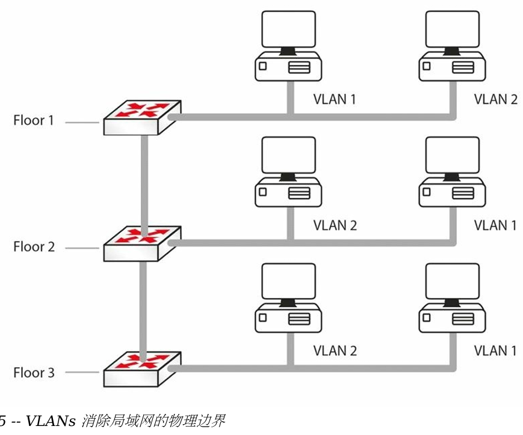

>VLAN 1位於一樓的主機嘗試與VLAN 1位於二樓的主機通訊時，二樓的那台主機是怎麼知道該流量是屬於哪個VLAN 的呢？

+ 幀標記（frame tagging）將不同VLANs保持隔離， 

因此一樓交換器將會給來自 VLAN 2的流量打上標記後，傳給交換器2, 交換器2 將會看到這個標記，從而得知該流量需要留在VLAN 2 中。  

VLAN1通常被視為原生VLAN（native VLAN），而**原生VLAN上的流量不被標記**

## 交換機端 
>+ 接入端口 or 接入鏈路 , access links or ports  
>+ 中繼端口 or 中鏈路 , trunk links or ports
>+ 動態端口

### 接入鏈路 Access	Links
>只能是唯一VLAN的一个成员。連接該接入鏈路的設備並不知曉任何其它 VLANs 的存在。  

來自主機的幀進入時,switch就將一個標籤加入該幀,從鏈路出去時再將他從幀中移除

### 中繼 Trunking
>需要傳輸多個 VLANs 上的流量, 需要區分每個訊框都是來自於哪個 VLAN。  
因為交換器連接埠通常既會連接網路上的pc,router,switch,server。

這種區分方式就叫做 “幀標記（frame tagging）"，  
在經中繼鏈路傳輸前，出原生VLAN外前，所有幀都已打過標籤。  
到達目的主機所在的那台交換器後，就移除。
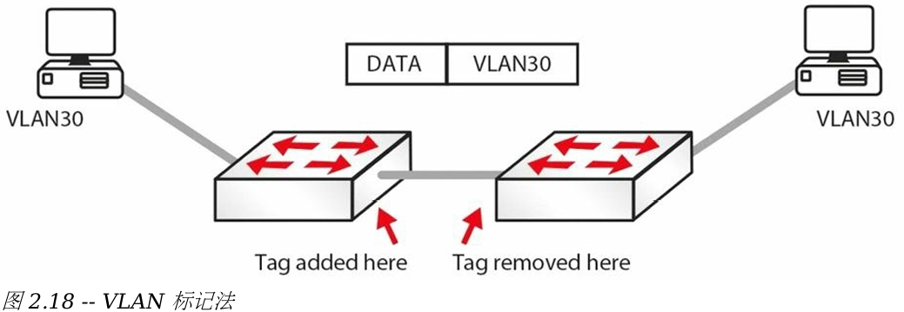

### 練習
**將其某個端口作為二層端口，而不是三層。**  `switchport`

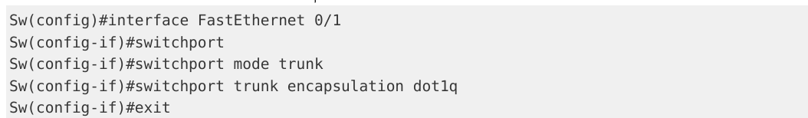
註: 在 2960系列交换机上，encapsulation不被識別，因為他只有一種型態

在將一台交換機與其它交換機連接時，你需要將其接口設置為中繼接口，以令到VLANs都被標記上。  
`switchport` 命令的作用也是如此，`port link-type trunk` //接口下把接口配置成trunk

### 練習
1. 創建vlan  
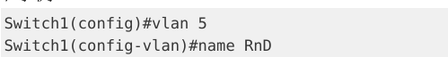  
`show vlan`命令来查看交换上存在着哪些 VLANs。  
介面設定指令 `switchport access vlan [vlan#]`,    

2. 將連接埠 fa0/1 加入VLAN 5 中去。
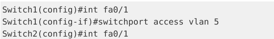
在像 3560 這樣的三層交換器上，在將某個連接埠加入到一個 VLAN 之前，  
你務必使用指令`switchport mode access`將連接埠手動設定為存取模式。

3. 讓我們來將兩台交換器的 fa0/15 介面配置為中繼連結。  
`show interface trunk`
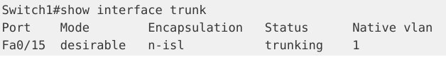
 其模式為我要（desirable）,封裝方式是ISL（n代表 negotiated,協商出的）
 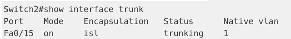

`switchport trunk encapsulation` 指令設定連接埠的中繼協議，  
而指令 `switchport mode trunk` 指令則是將連接埠設定為中繼工作方式。  
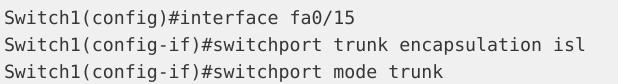

### 重要：   
將交換器某連接埠設定為中繼模式前，請先設定其中繼封裝方式。  
而這個規則 又不適用於 2960 交換器（目前CCNA中使用到的型號）  
，2960 交換器只使用dot1q（802.1Q的另一種叫法）封裝。  
因此，2960 交換器上的 `switchport trunk encapsulation` 指令沒用。  

 將交換器連接埠配置為 802.1Q 而不是 ISL，如下面的輸出。
 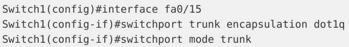

 `switchport trunk native vlan <vlan#>`更改預設原生vlan  
 中繼鏈路上的兩個介面原生 VLAN 必須 匹配

 ### 重要： 
 交換器能儲存所有 VLAN 的訊息，在重新啟動後也還在。  
 如你打算交換器以空白配置啟動，就需要在交換器上執行 `delete vlan.dat` 指令，如下面的輸出所示。  
 這只適用於真實交換機，在諸如Packet Tracer等交換器模擬器是做不到的。
 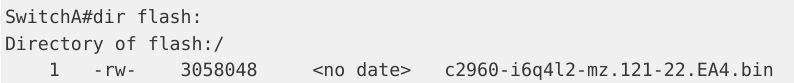
 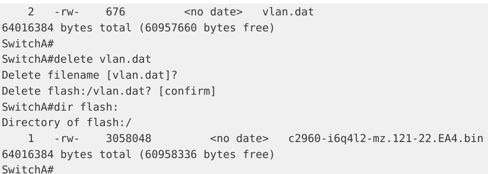

 

