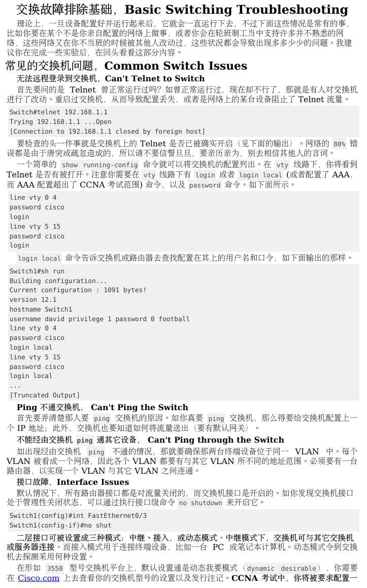
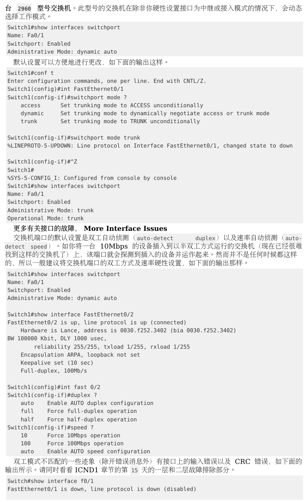
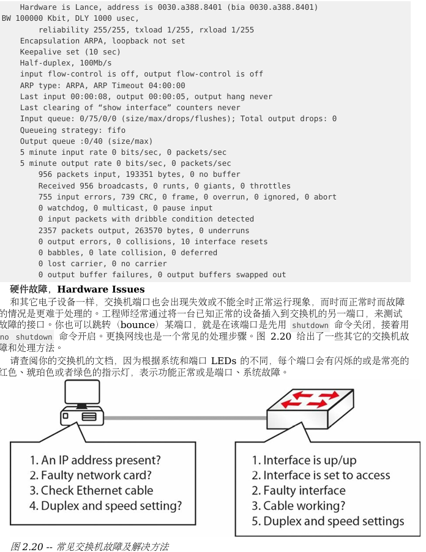

# Switch 故障排除基礎

# VLAN	分配故障，  VLAN Assignment Issues
>就是採用 VLANs 技術將不同網路區域進行邏輯隔離。  
當你遇到與某個 VLAN 相關的設定問題時，故障就會出現

有關 VLAN 故障的一個重要特徵是不會對網路的效能造成影響  
在排除 VLAN 故障時，首先要做的是查看網路拓撲圖，這樣你才能得知各個 VLAN 跨越的區域，  
以及對應設備和各交換器的連接埠狀況。

