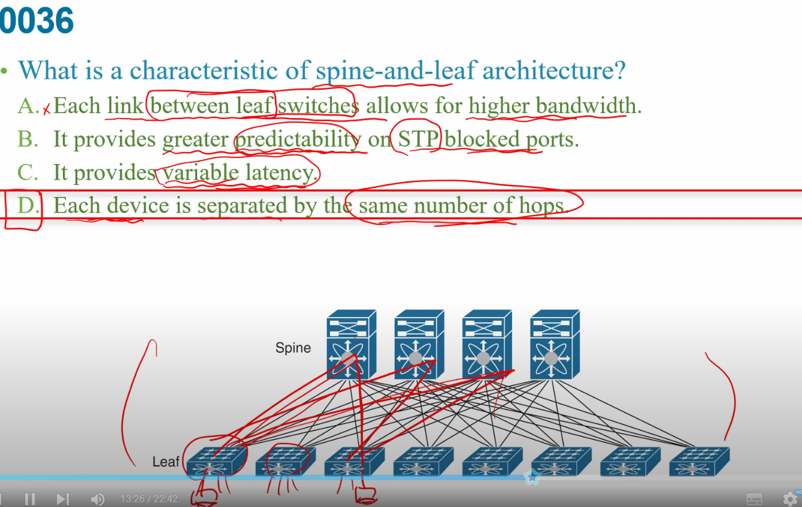
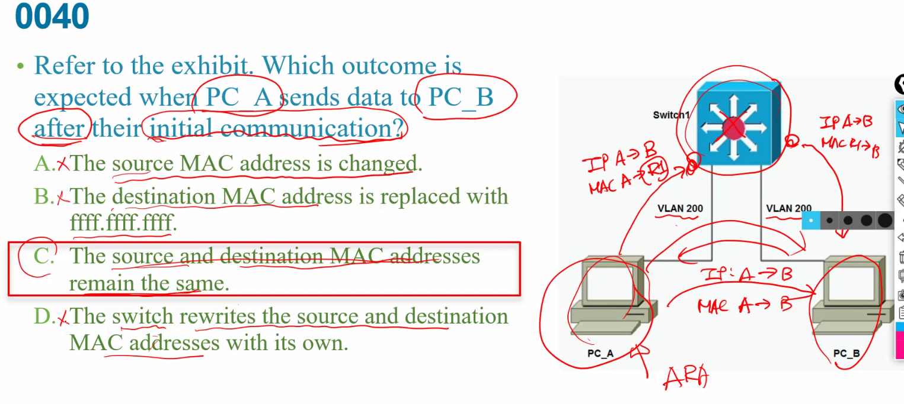

路由表前面:    
O = OSPF  
C = Connected 接在路由器上面  
E* = default  

MLS1 = MultiLayer Switch 1  

  
只要input error有發生以下事項就會+1

+ giants>1518就會錯誤  
+ runts <64就會錯誤  

  

### Association Response:  
STA用來表示無線設備或終端設備  
AP接收到Association Request後，進行身份驗證和配置，然後向STA發送**Association Response**，包含AP的**MAC位址**和**設定資訊**。  

  
A:一個Leaf Switch要連到所有Spine Switch
B:沒有限制  

  

Hypervisor 是一個軟體，讓您可以用來在單一實體機器上執行多個虛擬機器    
Hypervisor 會根據需要將基礎實體運算資源 (例如 CPU 和記憶體) 配置給個別的虛擬機器。  

A:不在LAYER3  
B:不只一個  
D:不能沒有她  

<mark>10.</mark> 答案是B [ c有疑慮要看m bit ]  
  

autoconfig有三種    
1. SLAAC  只告訴我們PREFIX而7沒有後面64bit  
2. SLAAC + DHCPv6    ----DHCPv6  stateles
3. DHCPv6    ----stateful  

0011
答:CD  
AB:global unicast  
C:link local 不是做multicast  
D:all node  就是以前的廣播 
E:all router  
  
0012
inet是host ip  
NIC MAC address 是00:0C:22....就是MAC address  
NIC vendor OUI(前24bit OUI)要看MAC address開頭00:0C:22  

三種轉發方式  
+ flooding
+ forwarding
+ filtering
交換器的過濾有兩種場景：   
（1）交換器收到資料幀後根據MAC位址表做轉發，不從其他連接埠泛洪資料幀；   
（2）交換器接收到資料幀的端口和轉送資料幀的端口是同一個端口，則丟棄資料幀不轉送； 

  

  
B:syslog是要超出最大值才出現  
C:和資料流無關  
D:無關  

  

    
  A:只能自己vlan  
  B:這就知道目的地了，但flooding就是要不知道目的地才用  
  D:要加除了原始接口   

  + private一定要經過NAT轉成合法ip  
  B:不能直接接到外部  
  D:private ip不是搞安全的  

    
  A:無關  
  B:需要  
  D:statefu的ipv6是 DHCP server直接指派，不是  

  
<mark>0025</mark>
老師覺得是CE  因為    
a:早期是23，但現在有24，34更好的  
c:cell如果有重疊overlap就要用nonoverlapping頻道  
D:repeaterAP只是延伸訊號而已    

A:BNC是同軸電纜用的    
cladding 保護層，外層    

  
CAPWAP:controller與AP之間的協定    
WLC:wireLess control  
b:可以不同switch只要中間有用trunk連好就好  
c: 不一定  

要找廣播
a:Global Uni Address  
b:Unique Local Address  
c:Link local Address  

  
c:是Distribution layer負責  
d:電腦連線都是acces layer  

  a:不同  
  b:這比較接近ipv4的private address  
  c:只能在link內部也出不去   

  
1. 將Mac address分成兩半24 24  
2. 中間插入FFFE 就有64BIT了  
3. 將第七個bit轉換  

a:不會是random的
d:需要FFFE  

  
答:c  
最接近至少都32個ip  

   
答:d
網路位置必須要被ip數整除    

a:沒有each和higher bandwidth  
b:根本不該有stp block掉  
c:可變動的latency   

 
後面那個數字是有幾個ip   
若整個8樓層都是一個子網路就是b   

  

  
下`show interface`    
a:runt是指收到<64bytes的frame  
b:前64bytes之內發生碰撞   
c:前64bytes之"後"發生碰撞  
d:最後面的sequence   

a:沒經過router，不用變  
c:已經有先initial communication了，所以來源終點不用改變  
d:router才需要換  

