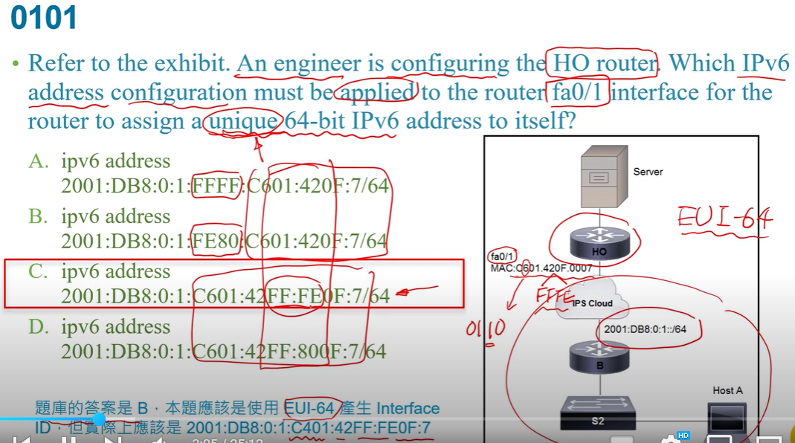
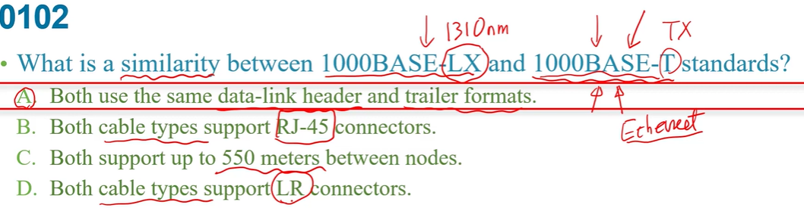
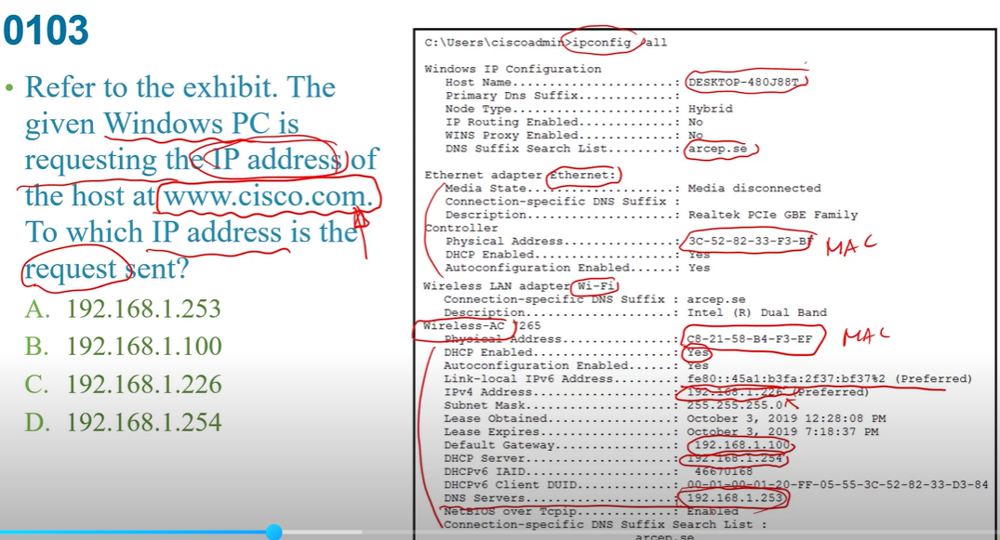
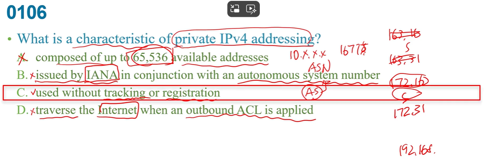
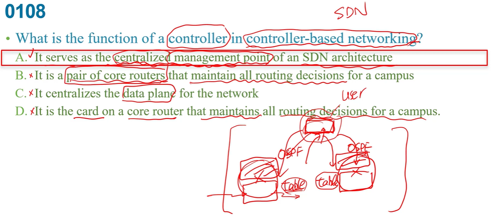

  
EUI64就是在網卡中間加入FFFE，第7個bit要01轉換  

LX長波光纖  ,  T雙絞線  
A:都是ethernet  
b:光纖不是  
C:1000BASE-T不可能
d:LR是光纖的  

找default gateway  

  
d:不需要在outbound ACL做什麼  

讓controller維護routing table  

b:他不是一對的core router，他是一台獨立的controller  
c:是control plane  
d:不是網路的core router 他是獨立的機器  

