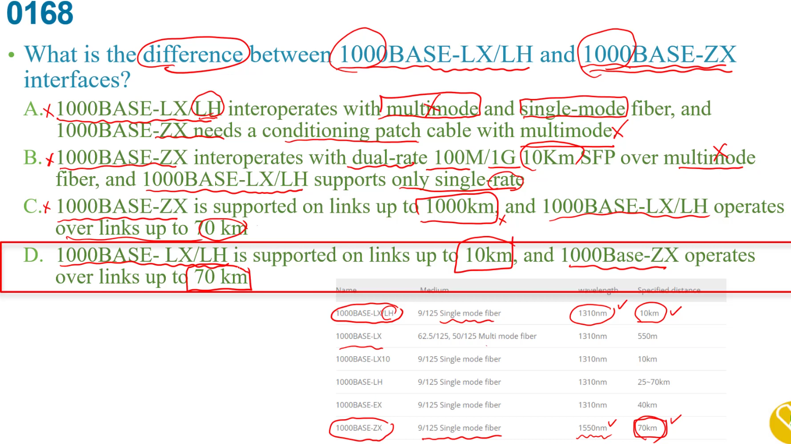
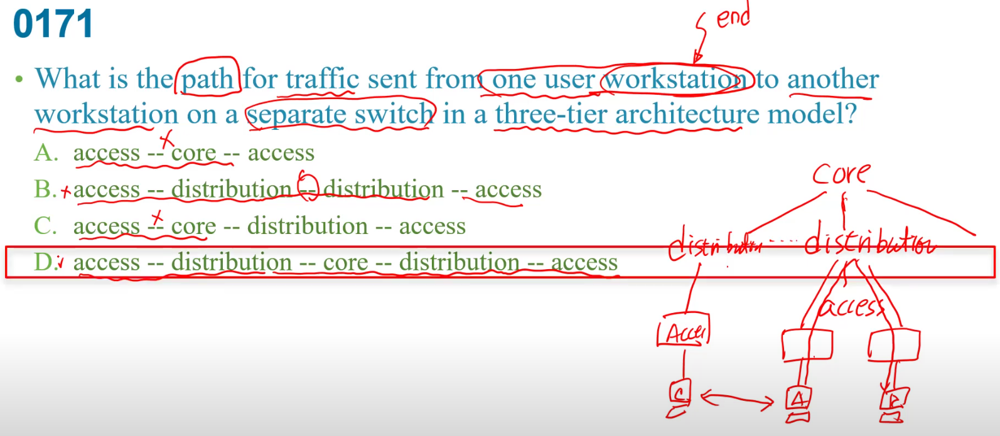

  
EUI64就是在網卡中間加入FFFE，第7個bit要01轉換  

LX長波光纖  ,  T雙絞線  
A:都是ethernet  
b:光纖不是  
C:1000BASE-T不可能
d:LR是光纖的  

要cisco的ip address就是要找dns server  

  
d:不需要在outbound ACL做什麼  

讓controller維護routing table  

b:他不是一對的core router，他是一台獨立的controller  
c:是control plane  
d:不是網路的core router 他是獨立的機器  

  
d:switch沒有roaming漫遊  

如果internal network是一個broadcast domain**小網路而已**就c  
如果internal network是不只一個網段就b  

c:不是nonoverlapping需要的  

A:是識別AP不是client    
C:沒規定一個AP就是一個WLAN,可以同個SSID    
D:提供secured access 不是SSID的工作  

SOHO network:小型網路  
b:小網路可能還只有一台switch

b:不是他的工作  
c:將那之間路由作摘要不是他的工作  
d:不是用來調整網路架構的  

B:是802.11ac,ad.....看技術
C:無關
D:ap有多個天線所以可以有多個SSID，同樣一個ssid也可以用在多個AP   

老師認為static
+ auto:偵測是否需要供電，但要足夠電力才會提供給裝置  
爭議:沒有保證電力  

+ never:沒供應沒偵測  

+ static :偵測是否需要供電，在發現需要供電之前，先保留預留電力 

還有30%成長
380*1.3<512  
所以512夠用  
需要兩個class C，可知子網為255.255.254.0 ->host 9 bit  

剩下C,D  10.7.54.0 ~10.7.55.255 扣掉廣播位置和自己  
得知D對  

<mark>Q130</mark>

看shoe run 那邊  
已經設了subnet interface給vlan2了  
所以要再設vlan3  

c:vlan10已經是native了，所以3並不是native  
d:vlan編號是10，遮罩也錯

Gi1/0要看能不能被4整除，128開頭(可被4整除)-131(廣播)   128,129,130,131  
Gi1/1要被8整除-->8,9,10,11,12...15  
Gi1/2 0-15 16-31 --->0-15可知last是14  

  

黃色部分:  
muliticast  
link-local address  
ULA unique local address  
unique address  

查看下半部的上面部分可知識CRC錯誤  
a:只有67沒有大量  
b:bandwidth頻寬,頻寬錯誤就不會是up了(上面)  
d:速度不一樣就不會通不會up  

b:跨vlan的傳送  
c:全網狀最可靠  
d:ex:分公司要經過總公司才能傳給其他分公司    

c:不會因為延遲高就有err-disabled     
d:應該會是"Administratively down”而不是err-disable，表示接口被人为执行了命令shutdown  
 

 

 他說test 成功代表cable沒問題，而且速度不同編碼方式不同有問題  

c: 雙工不一致status一樣會是up只是會很多collision  

使用private ip , NAT節省  
a:使用IPv6可以節省IPv4地址   
b: PAT:port address translation 裡面用private ip  

1. 需要產生8個子網路:需要接3個bit主機部分  
2. 子網路30hosts: 那就只剩下5個bit
3. 最後會是192.168.32.0/27  --> 192.168.32.30  

aliases:別名  
correlates:關聯  

兩個都光纖，一個單模一個多模  
+ LR 單模光纖  
+ SR 多模光纖  

  

<mark>題目154</mark>

name resolver和DNS蠻像的，但回應的是 resolver
 

157小超範圍  

+ 超過供電能力出狀況會發出"syslog message"  
+ 然後shut down 且err-disabled  
+ 原本port上電力釋放掉free掉  

b: drawing power如果沒有超過提供最大功率是不會有syslog message  

b:muliticast traffic 不會直接接在spine 而是leaf  
c: mitigate減緩，沒說是怎麼增加  
d:不會限制封包大小

b:把流量給下一站  
d:提供CLI存取是managemenmt plane   (CLI是Command Line Interface)   

b:止血fiber就沒問題有些人認為可以但問題是前面1000BASE，如果頻寬只有1000M那就不夠支持2.4 5g  
   

需要32個vlan向C class借5個bit,且三個主機host2的3次方=8   
  

  可知FCS:CRC-32有01的改變    
  可知要馬有雜訊,要馬CABLE有問題  

a:如果只有LX有單模也有多模，但這是LX/LH  ,ZX不可能跳線  
b:已經說1000base=1000M  ,不只單一速度  
c:70km , 10km     

  
unicast:1對1  
anycast:多部電腦用一個位置,但傳送時只有一個會收到(通常是最近的)
b:後面錯,IPv6還是需要指定  
c:後面錯,同上  
d:不是一群,是一個  

intermittent:間歇性  
找channel互相干擾的  
兩邊都是channel11如果連SSID都一樣，就可能變來變去不穩定  

<mark>背</mark>

2. layer2,3 tunnel主要是到ap不會到WLAN user client上   
3. ip是在layer3 ,但EtherType是在layer2，所以這很奇怪   

+ ESS 是多台ap組合起來的服務  
+ IBSS 不需要有中間的ap    

portfast是底下接接end device設的，不是交換器  
link up 之後直接接forwarding
a:是在forwarding狀態  
b:是當link up 之後  
c:portfast是底下接交換器才有  

a:portfast不處理這些,重啟spanning tree得重新計算  
b:有啟用BPDU guard才會做,前面有說after convergence所以動作已經結束了,沒D好    
c:和vty一點關西都沒有  
d:未啟用BPDU guard/filter會增加廣播風暴的機會  

layer2 ==> stp越小越優先  
layer3 ==> OSPF ,DR/BDR,HSRP越大越優先    

  
背 小超範圍  
聽不懂  

先比Priority,一樣在比網卡卡號   

  
  
即使是同一個VLAN，如果中間沒trunk還是會不通  
可知有native vlan不一致的情況  
 
b:沒有規定一定要enable  

service port:只能做management的用途 ,out of band management   
dynamic interface :讓封包從controller到ap之間    
virtual interface : 移動管理，在controller 底下的各個ap間切換   

    

negotiation protocols是PAgP和LACP而這兩個分別有圖上指令    
所以不能用那些  

on是啟用不管對方是哪一種  

用controller管理是lightweight  
自動的事autonomous  

  
c:每個ssid需要一個profile所以需要一個名稱  
e:是ap管理用的,和加入一個WLAN無關
  

  
b:是有哪些東西要交換給鄰居    

a:既然是transparents他就不會去process  
b:不會process她自行處理  
c:不會把自己(旁邊範例B)的資訊在傳去C，只傳vtp資訊  

  
一邊被動另一邊就是主動    
+ LACP   
MODE:   
+ active   
+ passive  

a:既然有一端desirable那就會變trunk  

這和我學的vlan之間tag不一樣，這是phone 是voice vlan(傳送的priority比較高)   
沒加tag就不是voice vlan的流量 
會不會加tag要看該access port的是哪個vlan   

a:2.4Ghz可用的就是1,6,11channel    
b:和TCP,UDP在LAYER不同  
C:最大到11,5.5,2,1Mbps  
d:最多到11Mbps    

要LACP    S
c:要把實體介面變layer3介面要下`no switchport`  
E:他要求的是LAYER3的ethernet channel  

ex:  
是layer2,C就錯了,剩E

