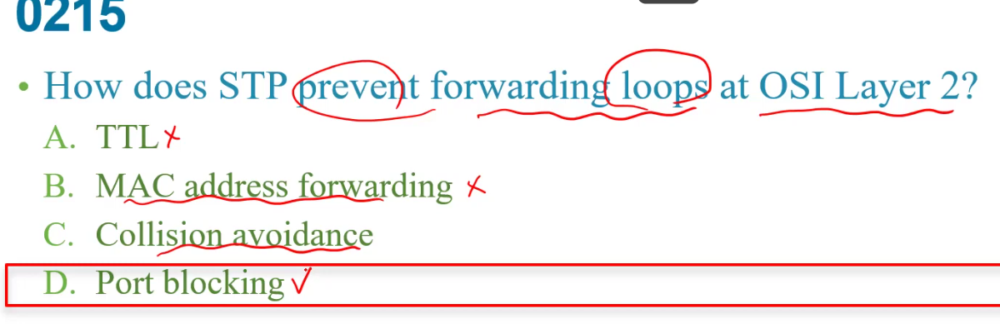

b:沒這指令,是cdp enable  
c:是在網路介面上  

a:多久傳送一次,不會這麼大數字  (秒)  
b:多少秒之後沒收到資料要認為這鄰居的lldp不在了 (秒)  
cd:多少時間開始傳送    

控制器可管理整個使用者vlan:  Easy deployment process  
AP自動調整強度: Dynamic RF feature    
controller自動部署image到AP:Easy upgrade process     
controller 使用負載平衡 去最大化輸出 : Optimized user performance  

  

陷阱  
**是問default vlan**  

  

cdp:　Cisco官方的  
LLDP: 標準 
 
 在這題有三個  
 + Duplex setting  
 + Vlan trunking protocol  
 + native vlan      

 cd: 本來STP就會交換了不需要用到CDP  

 a:WLAN controller 不見得需要負載平衡  
 b:每個SSID(網路)就是一個VLAN ,反而比A好  
 C:和wlan建置進來沒啥關係  

 因為sw1送出的frame是沒上tag的(sw1把valn10當native)  
 而sw2收到因為是native就傳往自己的native(vlan100)  
 

 a:TTL是layer3
 c:無線網路的CSMA/CA
  

B:和vtp無關  
c:其實會自己設定,只是他自己設定的也算是unique
d:client也可能是最大  

  

c:沒這東西  

a:CDP沒有管到physical layer  
b:不是cdp運作的   
c:Vtp的工作  
e:cdp可以取得layer3的ip位置資訊  
f:沒有得到這資訊