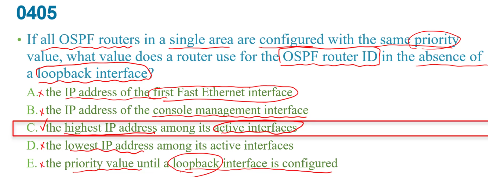

OSPF會當router id  
1. router id   
2. loop back介面ip最大   
3. active  介面ip最大   

要相同AS才能彼此交換    
router eigrp 100 ,這100是AS number    
d:1個就好  

c:設loopback其中一個用途就是用來設router id   
d:設loopback ip和cost值無關  
e:他是loopback最小的,所以他根本沒機會當DR   

a:第一個不一定是最大的   
b:console是沒有設ip的    
e:不一定要loopback介面    

hello protocol :送出hello封包,發現相對的鄰居  
b:預設40秒  
d:沒有參數之間的調整  
e:選路由器是DR/BDR,不是選最快的link當,是選priority最大,或router id 最大的  
f:hello適用multicast不是broadcast    

a:是看不到有沒有ACL套在上面的  
b:看不到  
d:資料不完全  

c:timer是預設的,所以不用特別設定  

從AD角度來看,static route先因為管理距離最小 > EGBP > OSPF > EIGRP  

雖然R1有下default-information originate,但還是缺少預設路由(他有寫gateway of last resort is not set)    
少了default route  
a:只有對外,連接internet的需要設  

a:除非是frame relate  
c:是nbma  
d:ethernet

