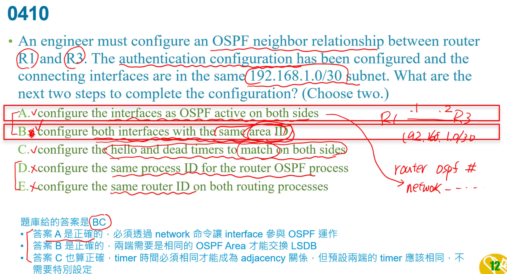

OSPF會當router id  
1. router id   
2. loop back介面ip最大   
3. active  介面ip最大   

要相同AS才能彼此交換    
router eigrp 100 ,這100是AS number    
d:1個就好  

c:設loopback其中一個用途就是用來設router id   
d:設loopback ip和cost值無關  
e:他是loopback最小的,所以他根本沒機會當DR   

a:第一個不一定是最大的   
b:console是沒有設ip的    
e:不一定要loopback介面    

hello protocol :送出hello封包,發現相對的鄰居  
b:預設40秒  
d:沒有參數之間的調整  
e:選路由器是DR/BDR,不是選最快的link當,是選priority最大,或router id 最大的  
f:hello適用multicast不是broadcast    

a:是看不到有沒有ACL套在上面的  
b:看不到  
d:資料不完全  

c:timer是預設的,所以不用特別設定  

從AD角度來看,static route先因為管理距離最小 > EGBP > OSPF > EIGRP  

雖然R1有下default-information originate,但還是缺少預設路由(他有寫gateway of last resort is not set)    
少了default route  
a:只有對外,連接internet的需要設  

a:除非是frame relate  
c:是nbma  
d:ethernet

a:next hop設定錯了  

EIGRP應該是要BANDWIDTH + DELAY  
d:cost是OSPF    

b:題目有說是DR不是DR other  

先看遮罩長度,相同才去看AD   

題目要我們設一個比較大的AD,就知他們要設浮動路由 ,備用的  
a:是gigabit0/0   
b:ad比較大不會取代  

a:backbone area 是0  
b:還是會有adjacency的關係  
e:和別的協議沒關係  .

a: ::0預設路由,不管什麼都送到new york router

  

 前面110是AD,193 才是metric  

 雖然最後遮罩是最長,但是卻是廣播,與SSH連到電腦不太一樣  

 
VRRP:  
MASTER 與 Backup  

FHRP就是指HSRP,VRRP,GLBP這種LAYER3的備援東西  
A:不太是他做得事情  
B:不是DEFAULT route資料,算是提供資料而已  
c:是STP的事情   

有說所有介面都passive,但giga1/0除外,R2也同理  
但R1有MTU1600(最大傳輸單位),預設是1500   

要選出dr,priority必須要最大  

到pc的是要經由r2  
再來255.255.255.255是因為只有一個ip  

state 不是full而是還在exchange  
MTU大小不一致所以才會保兩小時還在exchange  

a:沒有這設定  
c:讓他跑ospf  
d:priority是DR/BDR,但這是serial沒有DR/BDR  

a:應該是對方網段  
b:兩個都射到自己    

斷了還能正常就要浮動路由來補  
a:從gi0/0送出  
c:設錯介面  

C是直接連接  
L是LOCAL自己   
EX是外部路由   

D: priority是0-255而已  

  
priority要大於99  
是10.0.0.32/27可知是10.0.0.32-63  
c:是10.0.1.1不在該範圍  

ab:後面還是要接2019~::1  
c:ipv6 route是global的    

R18的wan是Fa0/0  
可以注意看後面ipv6 route  
A:要有ipv6 unicast-routing才會開ipv6的routing ,最後面next hop 應該是3::301   
c:3::301是0/0,後面ip rpute 也錯  
d:2::201是自己介面   

b:當用了next hop(192.168.0.2)後面就不能加interface了  
要加interface就要先interface後面在加next hop

 

