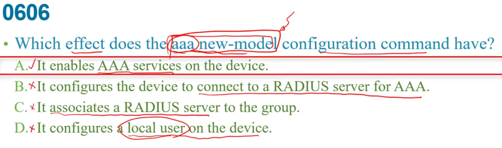

  
B是STP的    
c:bundle多個port是ethercannal    

A:VRRP本來就不是斯科專屬的,都多廠牌了  
b:有爭議  
c:是可以有迴路的   

 

是6進位所以14是0e   

IP SLA是service level agreement  
預期快還是慢,他的變化叫jitter  
ac:交換相鄰設備資訊,裡面沒有傳輸時間jitter需要東西  
b:無關,和事件管理相關  

b:是整個轉換的  

少了個gateway  
a:已經有dns server而且不用DNS 不建德一定要在同個子網路內  
b:有了因為已經拿到dhcp ip 了,只是無法聯外  
c:沒問題    

發生了ip 的衝突    
新版是從pool移掉,放到conflict table內直到衝突被解決  
b:傳統認為  

被指定出去的就是看binding table  

看到address lookup就是DNS  

下ip helper-address  xxxx 設定relay agent  
a:看ip或是layer1,2是down...狀況   
b:看位置被配出去的狀態  
c:看路由表  
e:看介面ip,input,output流量統計 
f:看pool設定  

DHCP server就是可用ip  
b:不一定要public ip  
c:沒有userame和password  

DNS  
+ 讓application可以用名子而不是ip去辨識一些資源  
+ 一個名稱綁定多個ip位置  

a:不是平的而是樹狀結構  
b:DNS不是作加密動作  
C:FQDNs就是名稱對應ip的服務,和SECURITY沒關西  

d:告訴你這個ip是透過dhcp還是啥方式取得的  
e:brief就是只有看到ip...沒有dhcp  

ex:  logging trap  4
是指顯示severity程度,而後面4是warning,debug就是debug  
debug就7級了最大了,所以都有  

有MIB大概就是和網管有關  

b:沒這東西  
c:DHCP relay  
d:設定dhcp可用ip的pool  

b:維護路由是routing protocol的事  
c:是EAP做的事情  
d:要求資訊是manager的事情  

a:都會有個租約期限要被renew  
c:最多8個  
e:不可能client維護是srever維護  

當SERVER: ntp master [數字]  
要讓ROUTER當NTP CLIENT: ntp server  8NTP-IP  
C:是和上一層的做一些認證  
 

是第五層,Notification  
狀態是up or down  
d:題外是connectless  

r1要下ip address dhcp  才能錯dhcp取得ip   
R2 g0/0要設定dhcp relay服務',設定`ip help-address +DHCP serverIP`(這裡是192.51.100.100)  
a:helper不是設在r1上  
d:設了就變他要透過dhcp取的ip  
e:自己都沒ip了怎麼當relate

  
WRED是Qos的排程機制,避免壅塞    
優先drop掉priority低的封包    

+ inside local  
+ outside local   

變  
+ inside global    
+ outside global  

b:檢查時區不是主要動作  
d:是設PSK,所以兩邊要一樣  

  
inside local  ---> 是private ip  
 inside global  ---> public ip    

老師覺得abcd都算對的  
如果沒下`ntp master` 只有下ntp server 正常來說看到的值是16(stratum)  
e:看不到version  

多個主機用一個outside ip --> overload  

ab:都是提供直接相連設備的一些information,且和QOS較無關  
c:ip的服務等級  
d:realtime network event detection  

manager發出get或set訊息給agent之後倒mib資料庫內找相對數據,回應get response  
agent主動發出就是有突發狀況,這種未請求的就是trap  

MIB:可監看參數的收集  

b:就是不需要帳號密碼  
c:塞車就更應該用ftp,確保送到  
d:主要是傳設定黨,要傳檔案主要是ftp為主  

  
輸入名稱救和DNS有關西  

LLQ優先再來PQ  

B:ASSIGN的程度不知道  
c:AP不需要像要associate的提供ip,遮罩,gateway  
d:沒這東西  

client和server之間基本上會有layer3設備,  
如果 DHCP Server 與 DHCP Client 在不同一個網段，  
 Client就無法配發到IP了，這時候可以使用 DHCP Relay (或稱為 IP Helper)，  
 傳送DHCP Client的廣播到DHCP Server以能將IP配發到Client。

要讓他當ntp server就在router上下`ntp master [4] `後面4是階層可有可無,數字越大越下層  
ab:ntp server就變成要去和別人校正時間了,但題目說是server-only所以不會去校正時間   

NMS即manager  
通常router,switch上會有個agent維護MIB的資料庫 ,若agent發現有重大事件(如interface up/down ) 就會發出trap,   

b:inform主要是manager用的  
d:不可能同台router又是agent又是NMS(manager)    

   

b:上層是去找192.168.1.1校正時間,且自身同時也是ntp srver      
c:沒backup這指令  
d:這就是從 192.168.1.1校正時間而不是在設定理的ntp srver  

  
看到DHCP discover就知是DHCP relay 的問題  

PAT: port address translation  
/27是32個主機  
bcd:前面acl錯,c是any了  

有了hostname和domain name 就要下c:crypto key  
vty那邊,因為指接受加密連線所以要加transport input ssh    
e:沒有一定要2.0才能加密   

只有v3才會用到user  
b:指定網管系統ip到底要哪邊   

要試NTP stratum 2就要下`ntp master 2`,知道我是server  
a:NTP走ud恩port123沒問題 ,但acl編號是10,不可能還去比udp port number  

proprietary 專屬的  
a:他有不是session layer  
c:要加密會用SFTP    

設好hostname ,ip domain-name之後才能去設crypto key generate RSA    

Qos流量管理機制分成traffic shaping , traffic policing   
b:buffer還沒滿之前就開始drop掉  
c:排優先順序   

要做這些動作應該要在trust介面  
右邊:  
34有32個是untrust port  
a:是server要設trust  
b:不是relay  

d:clock set 設定時間  
  

IL:Inside Local  
IG:Inside Global  
IL換成IG  
基本上不會用outside sourse  

 
 

a:傳輸buffer的處理,buffer晚點傳   
b:分類,照服務等級做分類    
c:傳輸buffer的處理,buffer drop掉
marking:修改 header值  

兩個網路介面少了ip nat inside 和ouside   

eq22是ssh  
source:68  
destination:67  
DHCP/BOOTP 的server:67 ,client:68   

bc:helper address 是設在0/1上    

a:是udp,67是server port number    

接受的適用哪牌機器-->所以host  
access string --> community  

+ hostname 不能預設值  
+ ip domain-name  
+ crypto key generate VSA  
+ username ____ password or secret ______  
+ line vty   
+ reansport input ssh  
+ login local  

a:password-encryption 無關   
c: domain name 都還沒設   
d:不該是all    

mitigate 減緩  
a:只傳送CIR頻寬  
d:還是一樣送64k,超過的晚點送而已  

overutilization 塞車  

3. 系統是指網管系統,alarm就要想到事件相關與集合  
4. identifies  

ntp server...找後面ip 校正  
123因為都有下ntp server 所以都是client  
可知r4是server   

注意outside interface 是沒設定的  
下面可知nat 轉換有設了  
a:本來就是e0/1了  
b:沒有解決,主要是outside interface沒設  
c:access-list LAN可知有設了  
  

c:facility不是代表一個group而是一個元件  
  

1. 利用client-server方式去控制網路segment  
2. 沒用認證server去紀錄
4. 
4. 是DNS工作  

DHCP serve是0.0.0.0可知不是dhcp分配ip 而是自己設定  
DNS server是0.0.0.0是因為沒設    

phone有用voice流量priority應該是最高,本來就會被mark他的DHCP值,所以sw1只要去信任就好    
pc則相對低,把他mark是哪個priority       
b:mark通常是在access layer  
c:MLS都沒做了更不用說r1  
d:應該只有trust phone那裡   

相對於data traffic要先強化voice traffic  
b:沒有優先次序關係  
c:高priority的優先傳輸,但缺點是低的可能永遠輪不到  
d:還是會保留一些頻寬給data,壅塞嚴重voice就還是可能被drop掉    

G0/1.100 的100是指valn100  
可知目前ACL只有vlan100的ip   

ap是layer2設備  

啟用port security本來就會預設學習  
c:和a一樣但會產生mac資料放在running config內   
acd都不錯但c有多功能  

一開始vtry telnet進去會是在user mode內,要用enable才會進privilege mode  
需要在 username 帳號 privilege 15  password或secret 密碼,且要login local才能用本地帳密去驗證    
(15是等級)  

只是啟用AAA服務  
b:所以這延伸的沒有  
d:無關  

violation mode 是開的,第5個進來的會被drop掉但前4個一樣留著,所以security violation count是0     
Aging time 不會根據沒在動時間就丟掉   
configured 是自己社的  
sicking  MAC 是自動學到的

要間看就要用到網管SNMP,最安全則是version3   

a:不錯在觀察,有點爭議,有些只有restrict會送    
c:是指定  
d:是最多學五個不是已經學了

