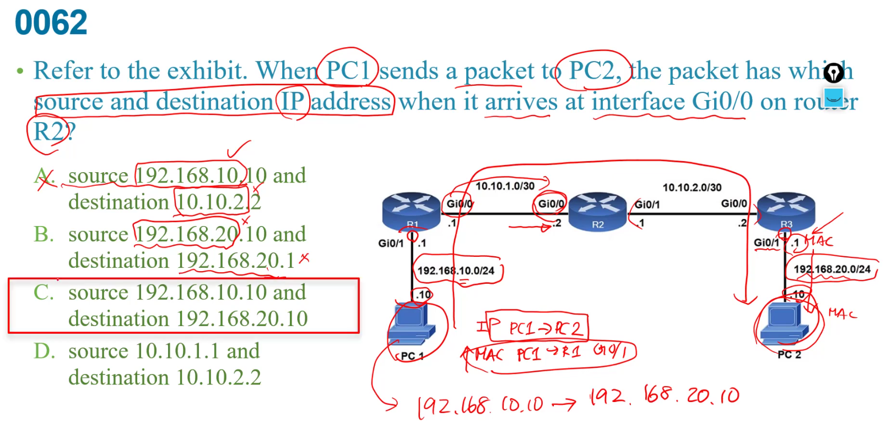

  
C:不用 因為他是獨特的  
F:應該是ip才對  

  
會有問題，因為都同個vlan，這兩個是同一個network  
對router而言每個介面都是不同的layer3 network  

D:ip都出不現了更不用題加密    

  
後面192.168.2.4是next hop    
前面才是目的地  

E:後面沒有再多加數字，指定administrative distance，所以是預設  
F:指的是default route ，但這並不是，而是一個static route     

A:private ip 不用遵守  
C:無關    
D:本地規定不會規定你要用private ip  

  
a:有限公司的有限上網or XDSL   
b:總公司與分公司之間的的連線用這個作virtual circuit  
c:專線  
D:ISDN淘汰了  

c:雙宿主主機    
d:未來增加公司規模就要整個重新設定   

老師認為d比較好  
ULA用FC00::/7   

b:算對但不恰當  
c:ip在layer3 和applications較沒關係    
e:和public ,private無關，是看network 狀態  

conserve:節省  

  
是mac在改變 ,IP終點起點不變  

a:只有fiber才有optical attenuator  
b:單一模組同時有single mode和multi mode很怪  
c:hot swappable 熱插拔  
d:光先是full duplex  

b:不太對，不是server主要功能  
c:"single client"-錯  

  
+ 兩層式就是把distribution和core合在一起     

a:原本是distribution的但合併了  
b: 沒a好，通常在WAN觸發  
c:雖然distribution有但一般在fire wall 比較好   
d:是access layer的   

1,6,11 nonoverlapping channel   
c:到底是一個ap一個channel還是總共共用一個  
d:可能有干擾  

  
B:client端重新連接上來
d:11ac是5G only  , MU-MIMO  MU是只muilti user    

SDN內容
data plane:主要一般user的處理  
control plane 處理routing protocol ,維護routing table  

A:manage plane  
B:control plane  
C:control plane    

  

intermittent間歇性  
正常來說可靠度reliability應該要像下面255/255  ，電路品質有問題  
+ txload 傳輸負載 1/255  
+ rxload 接收負載 1/255  
b:可知沒塞滿才1/255  
c:看都是SFP-LR一樣，所以不是接頭問題  
d:應該是site A有問題不是接頭問題  

 

  
 開頭0可以省略  

   

 a:不用讓管理者還有一台一台管  
 b:不是根據品牌，而是他的負載等等  
 d:是channel切換不是這個

