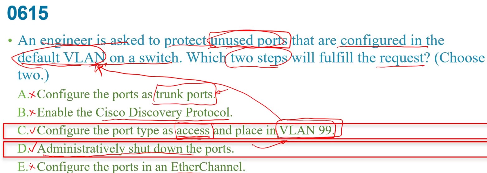
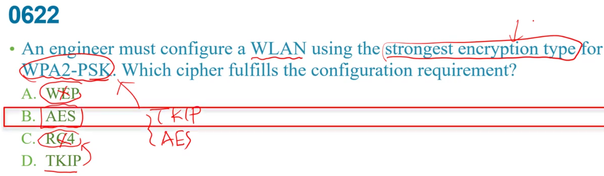
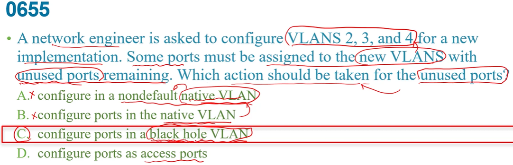

`ip arp inspection vlan2` 就是DAI  
a:沒看到shut down 命令  
b:DAI是啟用的,用不到arp acl  
c:下完`ip arp inspection vlan2`就是untrust  
d:直到設定為trust就不是down  

authentication 認證  
authorization  授權   
b:authentication不是控制,log是accouting  
c:不負責這  
d:認證密碼也在authentication  

A:所有VLAN都過來真糟  
B:如果對方也能接收CDP那他們會得知我們機種,等等資訊,容易入侵進來  
C:VLAN99是用不到的,就不要用DEFAULT vlan,而且也不是trunk,good  
d:直接shut down根本不給他link起來的機會  
e:不會把沒用的port設成etherchannel  

  
主要是有提到是公司發來訓練的  

wpa+wpa2 是看能不能和AP做聯繫的動作,所以是layer2  
802.1x要帳密才能連上這port,所以也是layer2  

題目有說給management用的,所以CPU ACL    
ad:驗證user帳密,漢來自哪個network無關  
c:和controller連線中斷,非獨立AP還是有功能   

產生金鑰是`crypto key generate rsa`  
在這之前需要1. hostname 2.domain name  

前面ip是來源,後面是目的地  
所以R2前後相反了  
且因為有隱藏的deny any any 所以需要一個permit ip any any,不然其他流量過不去    

b:再開始就permit,後面的deny就沒意義了  
c:對extened outbound來降同來源同目的地都沒差,但extended ACL要靠近來源較好  
e:要這樣就要把eq...放在來源ip後面    

ac:最早期的  
d:用RC4已被破解     

1. native vlan不要用預設的比較不會被猜到  
2. 用port security去管制,但選項沒有,用802.1x至少可以認證port  
3. MITM:假Ip 攻擊, 用 dhcp snooping 讓壞人無法用假的dhcp server提供假的ip 資料等等  

SSH是走TCP port 22,所以是eq22  
b:access-class 限制vty連線(連線到他的RTR),只有針對vty,但這機器不見得要連vty,所以還有機會連進去  

以套用ACL但介面還是allowed封包  

a:就看不到純文字密碼而是加密後的了  
c:和vlan database一點關係都沒有  

WPA3主要透過SAE加密,連上ap在認證過程    
後面DATA傳輸才是AES  
D:wpa2就有了   

可知有啟用DAI,過濾ip和MAC資料  
**trust通常設在連接router介面上**     

針對vlan5-10做DAI  
預設介面f0/1 untrust    
inspection主要把invalid的drop掉  
c:應該是進來的,不是dai要做的  
d:untrust不會把流量刪掉  

a:vpn傳user data  
bd:ip security tunnel建立中key的交換機制  
c:雜湊驗證資料有無問題  

LLA是FE80::/10開頭的  ,只能在broadcast domain使用  
ULA是FC00::/7 , 可在企業整個網路範圍當作private ip 使用,不能到網路  

a:本身就加密  
b:沒加密的   
c:明文的密碼透過type7的方式加密    
d:產生一個帳號cisco和密碼encrypt,但還是明文  

deny tcp any host 10.30.0.100 eq80  
any是來源 , host 10.30.0.100是目的地  
a:deny在permit any any 後面所以沒有機會比對到  
b:同上,且要vlan20  
c:把要到10.30.0.100的都deny  
d:只要是vlan20要道10.30.0.100 port80的都deny    

b:password manager 沒有內建防火牆,只是有比較強的密碼保護  
c:不見的一定儲存在自己電腦  
d:不會做到這  
e:保護鍵盤的敲擊紀錄    

a:減少暴露在網路上
b:用private或public都沒差,table看的是network 網段  

mitigate減輕  
就是DAI 過濾mac和ip是否合法   

主要是某個員工出去給他用去連接  
a:是side to side   
b:通常只有單一使用者    

關掉沒在用的port,native vlan不要用default vlan 

a:port很快起的來,沒用  
b:可做到一些保護,但對管理者負擔很重,不是好方法  
d:802.1x,要先認證才能用port  

第二行:要連到10.20.1.0通通被deny  
a:ssh不是udp,而且沒有目的地  
b:刪掉最後一行沒用,因為本來就被第二行檔掉了  
c:改255更錯    
d:等於把第二條刪掉  

violation模式必須是restrict或shutdown  

但最主要不該把該port變trunk介面,把vlan關閉掉或是把native vlan換成未使用的,預設是DTP AUTO  
A:為了避免ARP假造  

ip和mac對應的資料  
a:是mac和port   
b:主要是看CAM table  
c:等於CAM table   

LAN Controller不是用TFTP    

逼卡允許進入  
B:讀卡機不是讀生物辨識  

避免假造DHCP server  
1. 先發DHCP discover請求  
2. server就會給DHCP offer的回覆  
3. 如果接收的是untrust ,直接丟掉--->所以值會在DHCP或trunk所在的port去設DHCP SNOOPING   

a:不會用multicast  
1. discover 是brasdcast,因為不知道在哪  
2. offer採用unicast,因為已知mac address  
3. client發出request 也是broadcast    
4. ACK也是UNICAST  

B:可做到  
C:VTP PROTOCOLS的工作  
D:無關.

ab:未使用port應該用到未使用vlan或直接shutdown  
c:黑洞vlan就是未使用vlan  
d:本來就是access port,只是沒特別指定會變default vlan   

### ASCII  
+ AES至少需要8字元  
+ TKIP 至少需要12字元  

### HEX  
+ 64字元   

+ ISATAP主要是為了IPv6與IPv4之間傳送的問題,不是為了加密  
+ IPsec有加密功能,但是沒有multicast功能   
+ GRE不加密但可以multicast   

編號99是standard的  
編號如果是數字(正常是名字),1~99是標準,100~199是延伸不能用standard  
  

radius走UTP封包  
只把password做加密 

console預設沒login,但vty預設有login  
a:少了login  
d:privilege 15 是特權15,但是是用在username   
在這要用level  

3.4.他是說兩個隨機MAC,這樣就變成指定了    
+ 57不確定  

5.把學到的mac address放到running config內      
7.shut dwon 是預設值了   

1.有些認為在區別user是在哪個群組有一部分授權
2.看grant user acces可知是authentication,但後面授權telnet是authorization  
3.record amount of time ---> accounting  
5.看到**log** --> accounting  
6.是authentication   

>8.2.11r ---> 就是fast transition   

A:PMFrame是針對管理的frame   
B:是認證的部分,一點點關係    
c:WPA早就被淘汰  

 802.11w   
>透過保護management frame 交換去加強WI-FI網路

a:是802.11r  
b:不需要   
d:無關     

題目是問WPA3`才`用到的加密所以c    
c:主要用在authentication,主要還是用AES     

不能傳送multicast,broadcast 封包,所以才要GRE+IPsec    
D:LAYER2的東西不是IP封包的東西,但IPsec是ip封包   

half-open 不會有收到ACK的動作3way hand shake沒完成  

b:CRL是CA太久沒被刷掉,就要把失效得列進去  
c:RAS應該不是TOken  
e:純文字的密碼一定不是   

a:少了login會沒有檢查密碼  
b:radius後沒加local  
C:NO不能有  
d:要啟用AAA才會有login authenticication    

  

指漏洞被發現但修復資料來不及處理  
a:只是網路被佔滿而已  
b:malicious惡意,不同  
d:不是zero-day      

a:輸入一次就過了  
b:ex晶片卡,token產生器  
c:過期的密碼  
d:密碼資料庫,但密碼不該共用  

IPS檢查流量是否惡意攻擊  
a:檢查特定檔案和類型  
b:授權已被入侵的網路流量   
c:非ips工作  
d:非 

WEP:RC4  
WPA:TKIP  
B:認證和WIFI大小無關  
C:wep內就有psk了  
D:wpa2才開始有  

a:可用但不一定要用到keychain這些     
b:內部用的file server不該放在DMZ內  
c:usb掉了呢,usb可攜帶不好  
  

B:network controller 不會是IPS,會是獨立設備  
C:IPS不會和RADIUS有關,radius是WLC做的    
D:這是SWITCH  

1.local有username password ,radius tacacs有AAA功能  

  

實際上有兩種mode-----tunnel mode 和 transport mode  
transport mode:只針對data加密  
tunnel mode:原始ip封包整個加密  

b:network loop 即STP去解決,和PORT SECURITY無關  
c:錯的  
d:靜態也只能設定一個  

a:IPS--過濾惡意流量  
c:不會分開網段  
d:不可能  

vlan hopping預設每個port都在DTP auto之下,攻擊者讓該port認知是一個trunk  
各個valn流量就會跑到那,獲得資料  
---->可以DTP關閉,nonegotiate,port shut down ,直接設定trunk`switch port mode`    

b:並不是解決vlan hopping 的問題  
c:向multicast,broadcast還是會收到  
d:DAI是為了解決arp spoofing    

b:udp錯了,且因為有udp所以是extended ACL,而編號(10)是標準ACL所以不對  
c:110是extended的範圍,但前面卻寫standard,port number 也應該在後面(eq22)  
d:要用access class  

sdn:data,control plane 分開  
此題再問control plane  
b:是data plane  
c:同上  

LDAP後端的server認證,6不是在本機上  
a:用後端不太會用PSK  
b:WEP最弱的  
e:TKIP太弱了,要用AES 

