# 第三天 中繼、DTP 及 VLAN 間路由
## 本次用到的指令
switchport 切換變二層  
switchport trunk encapsulation [option]  (選擇中繼連結所要使用的封裝協定。)  
show interfaces	FastEthernet1/1	switchport  
switchport mode	trunk  將该端口强制变成永久（静态）中继模式。  
switchport nonegotiate  关闭 DISL 及 DTP 数据包发送  
show dtp [interface <name>]	  
show interfaces	trunk  
switchport trunk native vlan [number]   修改其默认原生 VLAN。  
interface [name].[subinterface number]     在該主要路由器接口上配置出了子接口  
encapsulation	[isl|dot1q] [vlan]      子接口配置命令    
show interface vlan	x
show sdm prefer	命令的输出，该输出告诉你当前的 SDM	配置以及资源分配情况。   
vtp prunning    將 VTP 修剪功能加入到你的交換器  

#  配置並驗中繼鏈路
>中繼是一個可以承載多種流量類型，  
每種流量類型都用一個獨特的 VLAN ID 做了標記，的交換機連接埠。
這樣做後接收的Switch就能分辨哪個數據是哪個vlan  

### 將需要的接口配置變一個二層交換端口
`switchport`指令去切換變二層   
(註:此指令<mark>只在相容三層或多層交換器上需要</mark>。二層交換器上並不適用。  
那些支援指令`ip routing` 的交換器才被認為是與三層相容的交換器。)

這是透過執行 `switchport trunk encapsulation [option]` 指令完成的。選擇中繼連結所要使用的封裝協定。  
+ [dot1q] 強制該交換機端口使用 IEEE 802.1Q 封裝方式。  
+ [isl] 強制該交換機端口使用思科 ISL 封裝方式。  
+ [negotiate] 關鍵字則指明說在動態交換機間鏈路協議（Dynamic Inter-Switch Link Protocol, DISL）  
及動態中繼協議（Dynamic Trunking Protocol, DTP）封裝格式無法達成一致時，**ISL 作為備選格式**。

### DISL:  
DISL 簡化了兩台互聯的快速以太網設備間 ISL 中繼鏈路的建立  
。在 DISL 協議下，只需鏈路的一端需要配置為中繼端口，因此而將 VLAN 中繼配置過程大大簡化。  

### DTP:  
cisco專有的點對點協議P2P,它在兩台交換器間協商建立起某種常見中繼模式。

### 查看端口配置`show interfaces [name] switchport`
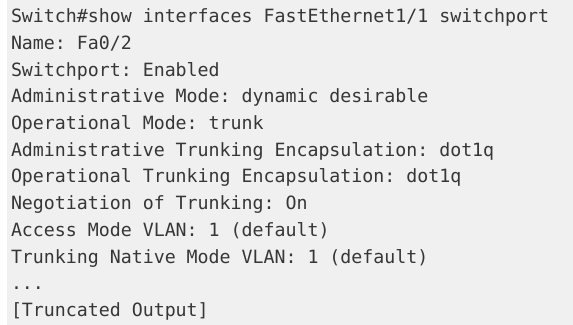

### 接口配置命令 `switchport nonegotiate`  
> 在靜態配置下作為中繼連結的連接埠上，關閉 DISL 及 DTP 封包發送，

## 動態中繼協議 , Dynamic	Trunking	Protocol , DTP
>在兩台交換器之間協商出一種常見中繼模式的，思科專有的點對點協定  
包含處理何種中繼模式，也包括中繼的封裝方式。

#### 能使用的 DTP	模式如下。
+ 動態我要模式，dynamic desirable   --若端口默認，會積極嘗試變成中繼埠。
+ 動態自動模式，dynamic auto  --若端口默認，連接埠僅會在相鄰交換器被設定為動態"我要模式" 時，才會反轉為中繼連接埠。  

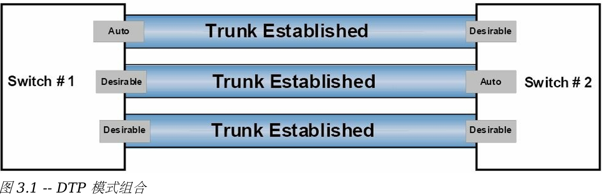
不可以兩邊都是auto模式

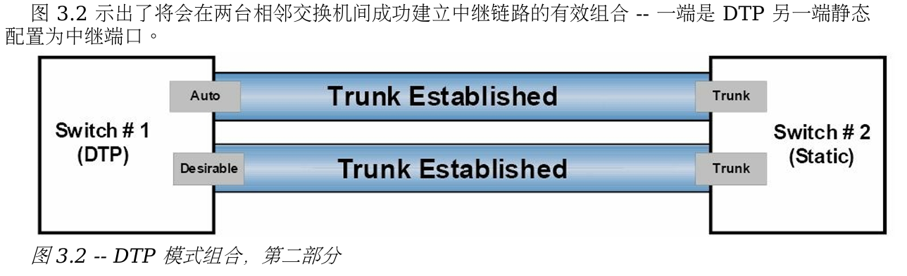

與此類，一個靜態配置的交換器連接埠同時配置了 `switchport nonegotiate` 命令的話，  
它絕不會與相鄰的使用 DTP 的交換器形成中繼，因為這會阻止 DISL 和 DTP 封包從那個端口發出。  

### 顯示switch全局DTP資訊以及特定接口的DTP訊息 `show dtp [interface	<name>]`
#### 全局DTP資訊:  
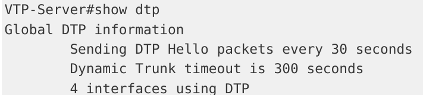
可得知:   
+ 30秒發出一個DTP封包。
+ DTP超時被設置為300秒  
+ 目前有4個接口在使用DTP  

#### 特定接口的DTP訊息:
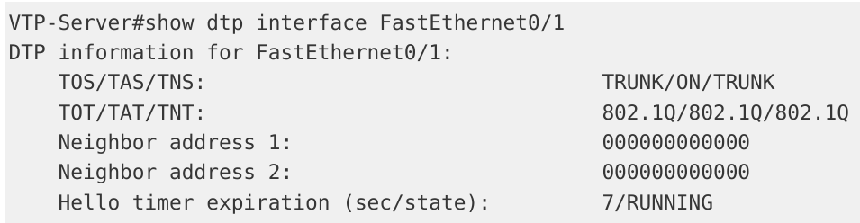
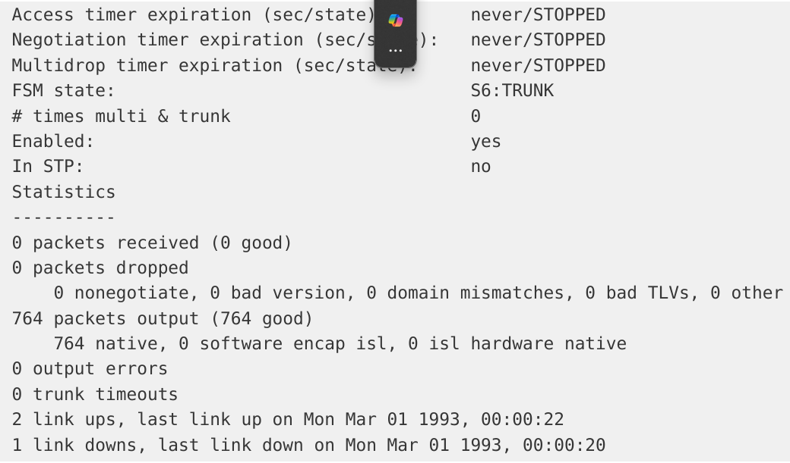
可得知:  
+ 介面的類型（中繼或存取）  
+ 連接埠目前的 DTP 配置  
+ 中繼的封裝方式  
+ DTP 封包統計資訊

## IEEE	802.1Q 原生 VLAN
>回顧: 802.1Q 、 VLAN 標記法 -- 在除了原生 VLAN 的訊框外的所有訊框中，插入一個標籤。  
+ **原生 VLAN** : 可以手動修改為任何**不在保留 VLANs** 中的任何有效 VLAN 編號的。  
`switchport	trunk native vlan [number]`  
+ Switch會使用 vlan1來承載一些特定的協議流量，如:CDP、VTP、PAgP、DTP
#### 查看默認原生vlan 
>命令`show interfaces	[name] switchport`	或	`show interfaces trunk`  

#### 注意:　中繼連結兩端上的原生 VLAN 必須一致
如果發生不匹配    
1. <mark>STP , Spanning Tree Protocol (生成樹協定)</mark> ，就把該端口設為<mark>端口VLAN ID (PVID)</mark> 不一致狀態，且不會轉發該鏈路
2. **CDPv2** 也會在交換器間傳送原生 VLAN 訊息   
3. 出現原生 VLAN 不合後，將會在交換器控制台上列印錯誤訊息

##  VLAN 間路由，Inter-VLAN	Routing
>因為一個 VLAN 中的主機卻是不能直接 和其它 VLAN 中的主機直接通訊的。  
因此必須對不同 VLANs 間的流量進行路由。

switched LANs中的 VLAN 間路由有三種實作方式 :
+ 採用實體的路由器接口的 VLAN 間路由, using physical router interfaces
+ 採用路由器子接口的 VLAN 間路由,  ---- using router subinterfaces
+ 採用交換器虛擬接口的 VLAN 間路由, -- using switched virtual

### 採用實體的路由器接口的 VLAN 間路由
>需要用到有多個介面的路由器，來作為每個單獨配置 VLAN 的閘道。   

**優點**: 簡單易部署   
**缺點**: 沒有可擴充性    
ex: 當交換器上配置了有 5 個、10 個，甚至 20 個額外的 VLANs 時，  
路由器上就要有相應數量的實體介面才行。 技術上不可行。  
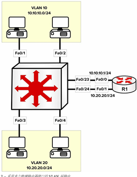    
 上圖(3.3)用到兩個不同 VLANs 的單一LAN，這兩個 VLANs 都有分配給各自的 IP 子網路。   

儘管圖中畫出的網路主機都是連接在同一實體交換器上，但因為它們處於不同的 VLANs 中，  
 VLAN 10 中的主機與 VLAN 20 中的**主機之間的封包必須要經過路由**才行，而在同樣 VLAN 中的封包只需要簡單的交換。  
 
 各需要的 VLAN到路由器的交換器鏈路，被設定為接入鏈路acess。   
 然後路由器上的實體介面都配置上對應的 IP 位址，而 VLAN 上的網路主機，  
 要麼以靜態方式配置 上對應 VLAN 的 IP 位址，將該路由器實體介面作為預設網關，  
 要麼透過 DHCP 完成配置，下圖演示交换机的配置:
 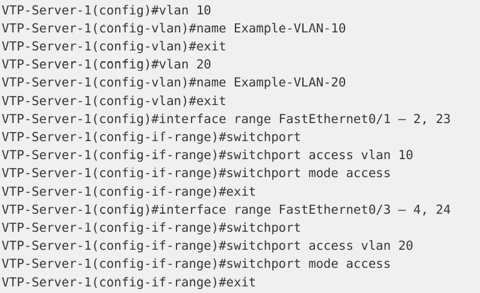

上圖`interface range FastEthernet0/1 – 2, 23`它提到的是 FastEthernet 介面，  
範圍從 FastEthernet0/1 到 FastEthernet0/2 和 FastEthernet0/23。    

下面示範了圖 3.3 中的路由器的設定。    
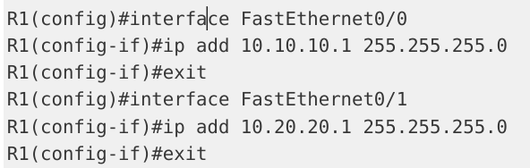

### 採用路由器子接口的 VLAN 間路由
>只需要路由器有一個實體介面就行，接下來的子介面是經由在那個實體介面上的設定獲得。  

**優點**: 解決多路由器物理接口方法的擴充性問題，router僅需一個物理接口     
**缺點**: 當存在許多 VLAN 間流量時，路由器很快就會成為網路的效能瓶頸  

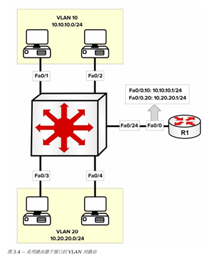    

上圖3.4和圖3.3描繪了相同lan。  
但在圖 3.4 中，僅使用了一個實體路由器接口。
<mark>同一個vlan中可以不只一個子網路，但很不推薦</mark>
#### 在該主要路由器接口上配置出了子接口 :`interface [name].[subinterface number]`  
#### 子接口配置命令: `encapsulation	[isl|dot1q]	[vlan]`後面可加`native`設為原生vlan
那條連接路由器的單一鏈路，必須設定為中繼鏈路，這是因為路由器不支援 DTP。  
以下示範使用單一實體介面的 VLAN 間路由配置（又稱作「單臂路由，router-on-a-stick」）。    
  
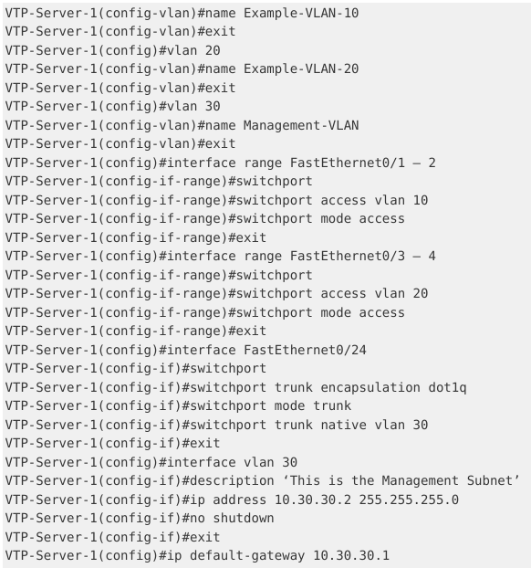  

圖 3.4 中繪出的有兩個 VLAN，管理用的額外VLAN 且該管理 VLAN 將會被設定為原生 VLAN。  
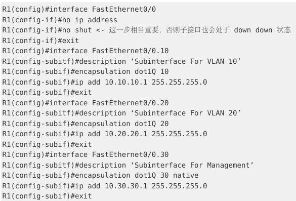

### 採用交換器虛擬接口的 VLAN 間路由
>接口設定指令`no switchport`對這些接口進行配置，以允許管理員在其上配置 IP 位址。  
 --- 将交换机接口从交换机端口模式更改为路由器接口模式  

 多層交換器也支援交換器虛擬接口（Switch Virtual Interfaces,<mark> SVIs</mark>）技術。 
#### SVIs:是一系列代表了 VLAN的邏輯接口。  
雖然某個交換器虛擬介面代表了一個 VLAN，它也不是在某個 VLAN 在交換器上設定出來時，就自動配置出來的；  
它必須要管理員透過執行`interface vlan [number]` 全域設定指令，手動加以配置。

如 IP 分址等的三層配置參數， 也要與在實體接口上一樣，在交換器虛擬接口予以配置。
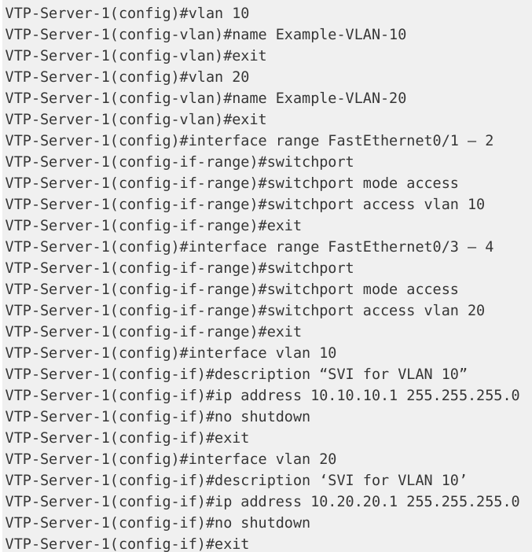  

在使用到多層交換器時，交換器虛擬連接埠是建議的設定方法，和實現 VLAN 間路由的首選方案間路由的首選方案。  
你可透過使用 `show interface vlan x` 指令，來驗證某個交換器虛擬接口是設定適當的（IP分址等）

### 交換器資源分配方式:  
此資源管理方式叫做交換器資料庫管理（Switch Database Managent,SDM）範本。  

+ 預設（default） -------------------------各項功能的平衡IPv4/IPv4   
+ 雙協定支援（dual IPv4/IPv6） ----------用於雙堆疊環境(dual-stack environments)   
+ Lanbase-routing   ------------------------ 支援各種單播路由(Unicast routes)  
+ 服務品質（Quality of Service, QoS） -- 提供對各種服務品質特性的支持  

**交換器型號**及 **IOS** 對 **SDM** 配置選項有影響，因此，你要查看你的型號的配置手冊。  
`show sdm prefer` 指令的輸出，該輸出告訴你目前的 SDM 配置以及資源分配狀況。  
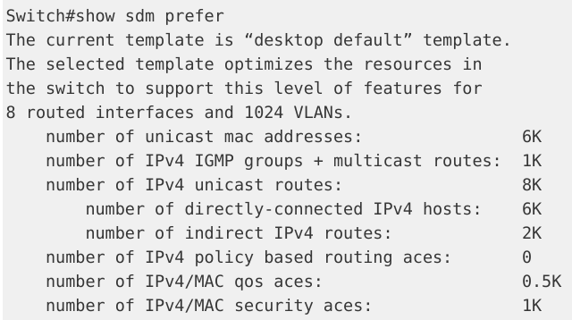

# 虛擬區域網路中繼協議，VTP
>cisco專有的二層消息協議，用於管理同一個 VTP 域中交換器上 VLANs 增加、刪除及重新命名。  
優點:  
+ VLANs 資訊的精確監控與報告   
+ 整個網路上 VLANs 的一致性   
+ 易於新增和移除 VLANs  

VTP 允許 VLAN 資訊在交換網路（the switched network）上 宣告/擴散（propagate），這將減輕交換網路中的管理開銷  
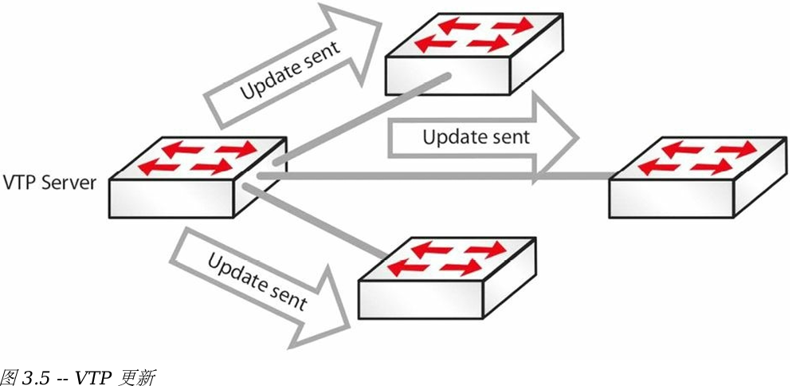

## 配置 VTP  
> 若要讓交換器進行 VLAN 資訊交換，這些交換器就務必設定在同一個 VTP 域中
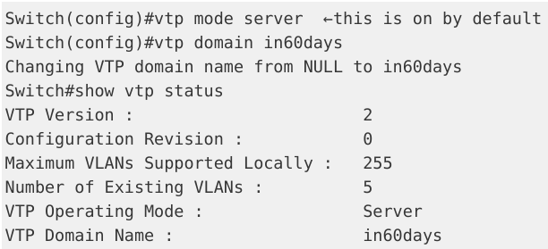

## VTP 模式  
+ 伺服器模式（預設模式）  
+ server(default) 客戶端模式  
+ client 透明模式, transparent

### 服務器模式, Server	Mode
>此交換器被授權去建立、修改及刪除整個 VTP 域上的VLAN 資訊,你對服務器所做的任何修改，  
都會擴散到整個域中。  
 **VLAN 配置是儲存在位於快閃記憶體中的資料庫文件“vlan.dat”中的。**    

### 客戶端模式, Client Mode  
會接收 VTP 訊息，並根據收到的通告訊息做出配置上的改變， 而不能增加、移除或是改變它們的 VLAN 訊息了。  
+ 用戶端交換器也會在它們的中繼埠上，發出接收到的 VTP 封包。  
+ 不能將客戶端交換器的某個端口，添加到 VTP 伺服器上不存在的 VLAN 中去的。  

 **VLAN 配置也是保存在位於快閃記憶體中的VLAN資料庫檔案 “vlan.dat” 中的。**  

### 透明模式，Transparent   
> 將在它們的中繼埠上轉送接收到的 VTP 訊息，卻不會應用通告的更新  
+ VTP 透明模式交換器是可以建立、修改並移除 VLANs 的 ,  
但其VLAN 配置變更**不會通告**給其它交換機

用途:  
當處於 VTP 伺服器與客戶端之間的某台交換機，需要有不同的 VLAN 資料庫時，  
它就需要是一台 VTP 透明交換器。而要設定上擴充的 而要設定上擴充的 VLAN 編號範圍時，也要用到透明模式

### VTP 修剪， VTP Pruning  
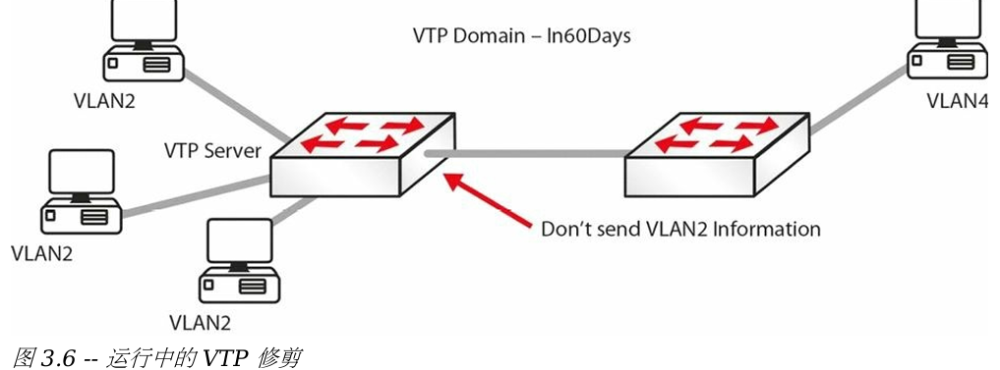  

下面這行設定將 VTP 修剪功能加入到你的交換器。 `Switch(config)#vtp prunning`  

而當你將一台處於其它兩台交換器之間的交換器設定為透明模式時，該組態就沒有任何意義了，   
***透明模式交換器上的 VTP 修剪不會運作。***

# 配置修訂號，Configuration	Revision Number  
>設定修訂號是一個 32 位元整數，用於表示 **VTP 封包的修訂等級**  
（在上面的 `show vtp status` 輸出中可以看到）。  

 + 判斷收到的訊息是否與目前版本要新  
 每次此處於 VTP 伺服器模式的交換器上做出 VLAN 變更時，設定修訂號就會**加 1**, 同時變更會通告給 VTP 用戶端，  
 （處於 VTP 透明模式的交換機，其修訂號會是 0, 且不會隨VLAN 資料庫的變動而增大）。  

交換器配置修訂號重設: 
 修改 VTP 域名稱，然後再改回早前的名稱，就可以實現交換器配置修訂號重設。
 
 #### 注意  
 將一台新交換機連入到區域網路時，一定要小心謹慎，不然有可能把整個區域網拖垮（總是要檢查檢查目前的 VTP 狀態）。  

 因為匹配的 VTP 域名，同時有著**較高修訂號的一台交換機被配置為 VTP 伺服器**，  
 或者**當 VTP 用戶端而接入網路時**，它的資料庫將會被通告給其它交換機，進而潛在地將它們各自現有的 VTP 資料庫進行**替換**。

# VLAN故障排除基礎 

### VLAN 間路由無效，Inter-VLAN routing not working :    
+ 檢查**鏈路、路由器**是否正確，  
+ 檢查路由器子介面有配置了**正確的封裝方式**和 VLAN，  
同時子介面的 IP 位址是那些主機的預設閘道。   

+ `show interface trunk` 指令將提供所需資訊。
### 無法建立 VLANs :  
+ 檢查交換器的 VTP 模式是否被設定成了 **“client”**，模式為 “client” 時，是不能建立 VLANs 的。

+ `show vtp status` 指令將提供所需的信息

### 同一 VLAN 中的主機之間不能通訊  
+ VLAN 中的主機是否都有一個屬於**相同子網路的 IP 位址**。如子網路不同，它們之間就無法通訊。  
+ 這些主機是否都是連接到**同一台交換器**。  
+ 如它們不是連接到同一交換機，就要確保交換機之間的**中繼鏈路**運作正常，  
還要確保該 VLAN 未在允許清單中被排除/被修剪

# 故障排除 
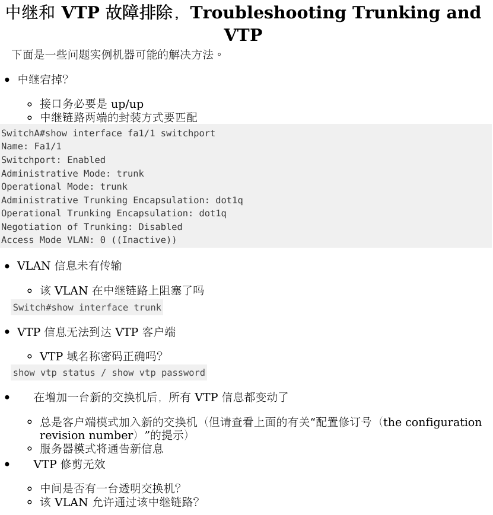

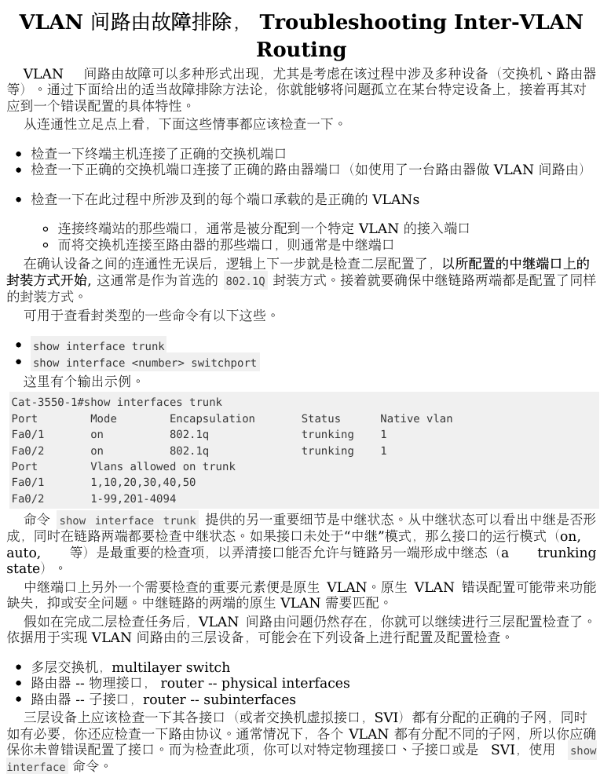

  

# 問題
+ 單個 VLAN 可以支援多個子網但是很不推薦
+ 一個接入鏈路（access link）只屬於一個VLAN。它只承載單一VLAN的流量

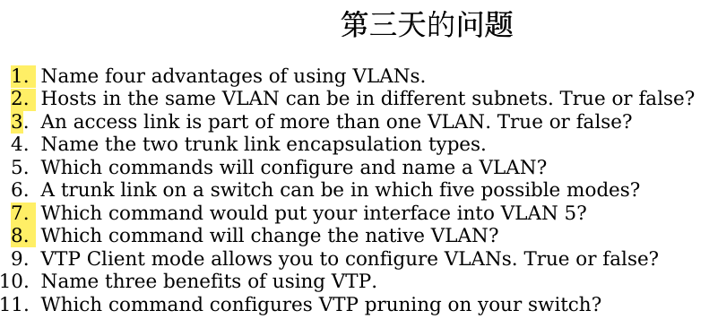　　

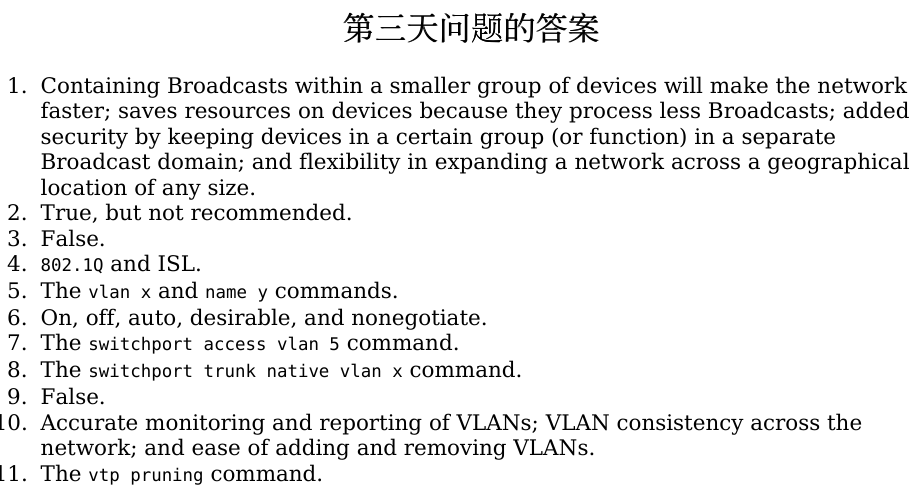

