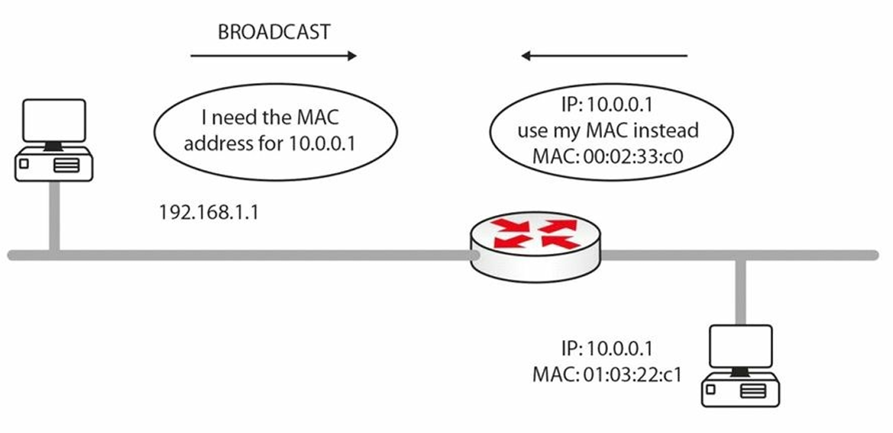
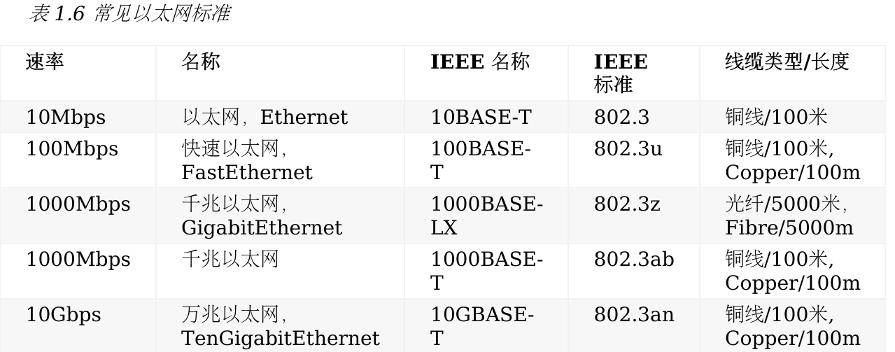
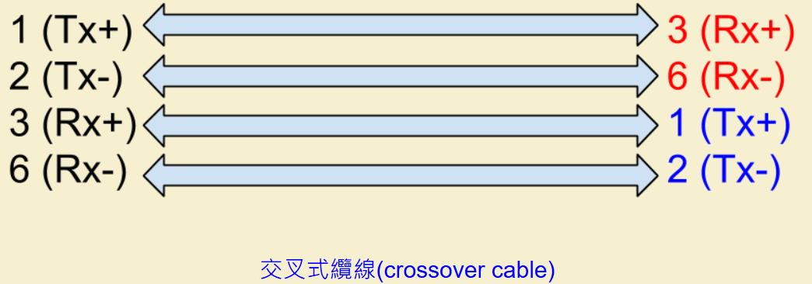
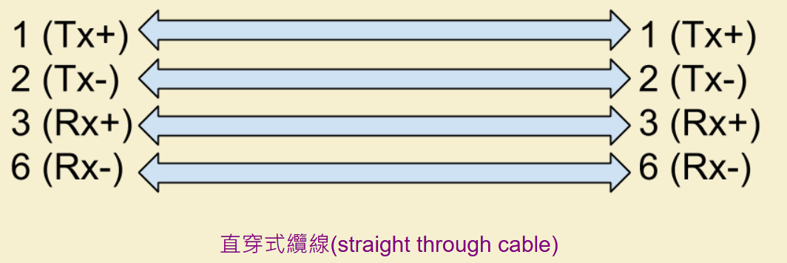
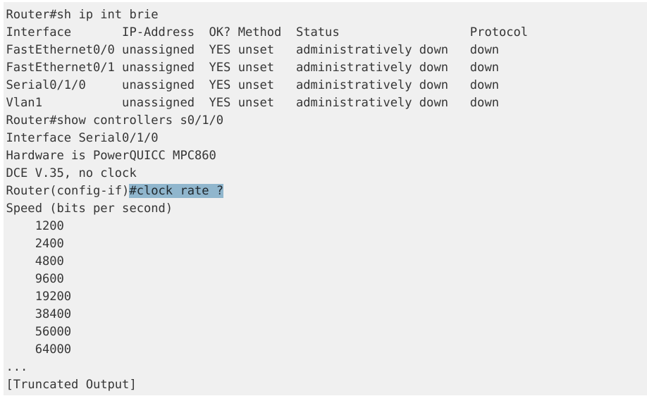
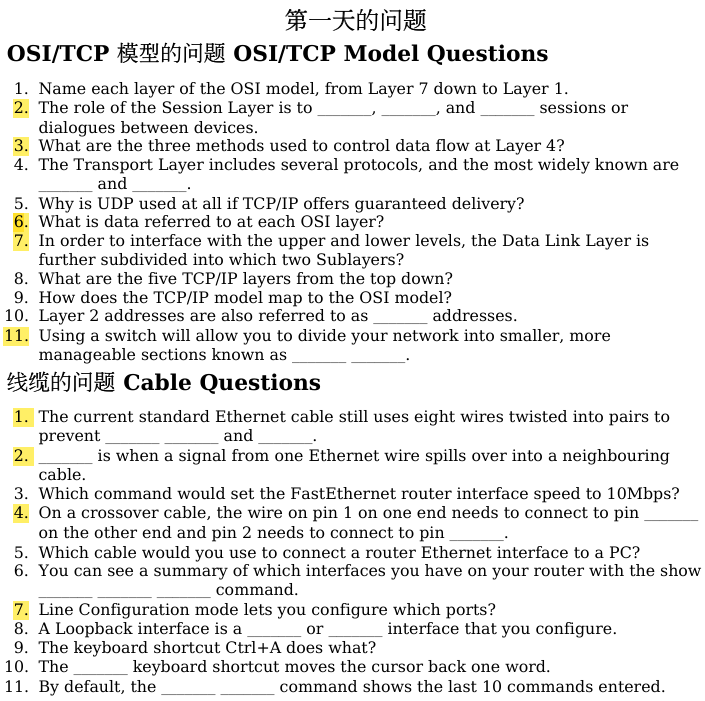
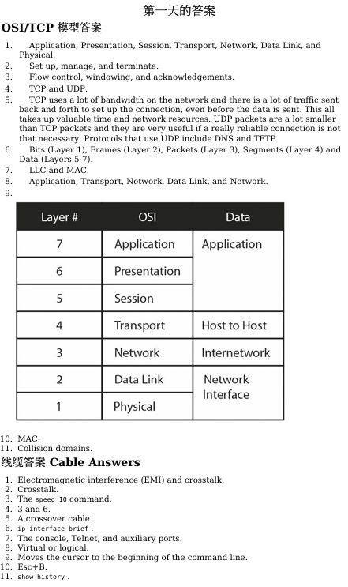

# CCNA筆記
由[60天通过思科认证的网络工程师考试](https://github.com/gnu4cn/ccna60d)整理後編寫的自我筆記
 
# OSI	和	TCP	模型
### OSI 模型:


傳輸層
以下是三種控制數據流的方法： 
+ 流控 flow control 
+ 視窗機制 windowing
+ 通告機制 acknowledgements
#### 流控 
如發往接收系統的資訊多於它所能處理的量時，它將請求發送系統暫停一段時間。 這一般發生在一段使用寬頻而另一端使用撥號上網的時候。 這個用於通知其它設備停止的包叫做源抑制消息（a source quench message）。 


#### 窗口機制 
窗口機制下，每個系統就能在收到應答（acknowledgement）前發送多少數據達成一致。 “窗 口”隨著數據的傳輸時開時合，以維持一個持續的數據流。


#### 通告機制 
在收到一定數量的數據段后，接收端需要就這些數據段的安全抵達和順序正確，通告發送端。

這些都是在一個叫做三次握手（a three-way handshake）的過程中達成一致。 


你要發出一個包來建立會話。 第一個包叫做同步（synchronise, SYN）包。 遠端設備以同步應答（a synchronise acknowledgement, SYN-ACK）包予以回應。 第三步的應答包 （acknowledgement， ACK）的發出標誌著會話的建立。 這都是通過 TCP 業務完成的。


### UDP	用戶數據報協定（User Datagram	Protocol,	UDP）
是一個無連接協定（a	connectionless protocol）
它在對數據包進行編號后就發往目的地了。**它絕不會管這些數據包是否安全抵達**
你只知道數據發送出去了，而永遠不知道是否送到。

常見的 UDP 連接埠號有以下這些：
+ DNS	--	53
+ TFTP	--	69
+ SNMP	--	161/162

**優點:** UDP数据包比起TCP包要小很多

### TCP	傳輸控制協定（Tranmission Control Protocol, TCP）
TCP 運行於 OSI模型的傳輸層。提供了一種用於網路設備間可靠數據傳輸的面向連接服務。
TCP提供流控、佇列（sequencing）、視窗機制以及錯誤偵測。

常見的 TCP 連接埠如下所示：
+ FTP數據--	20
+ FTP控制	--	21
+ SSH	--	22
+ Telnet	--	23
+ SMTP	--	25
+ DNS	--	53 (也使用	UDP)
+ HTTP	--	80
+ POP3	--	110
+ NNTP	--	119
+ NTP	--	123
+ TLS/SSL	--	443
  
**優點:** 使用一些技術來保證數據安全地到達其目的地。
**缺點:** TCP 協定本身會消耗許多網路的頻寬，甚至在數據還沒發送時，為建立其連接，也要重複發送很多流量。

### TCP	模型:


#### OSI故障排除
建議由下往上檢查(層數)
1. 第一層
   + 所有線纜都恰當地插入到port了嗎？ 還是有的鬆掉了？
   + 網線頭已經彎掉或是磨損了嗎？ 如果網線有問題，設備上的指示燈會呈黃色，而非正常的綠色。
   + 是有人沒有往介面上配置正確的速率嗎？ 乙太網埠速率有被設置正確嗎？
   + 介面有開放給網路管理員以使用嗎？ 
2. 第二層 -- 介面有採用正確的協定，比如 Ethernet/PPP/HDLC，以便能夠與另一端保持一致嗎？ 
3. 第三層 -- 介面有使用正確的IP位址以及子網路遮罩？
4. 第四層 -- 有使用正確的路由協定嗎？ 從路由器通告的網路是正確的嗎？

### 對比

新版第一層tcp分為 資料連結層Data Link和物理層Phycial  
***"All	People	Seem	To	Need	Data	Processing"***

#### 文件傳輸協定，File Transfer Protocol，FTP
FTP 使用了 20 和 21 號端口。
文件傳輸協定工作於應用層，負責透過一條遠端鏈路可靠地傳數據。因為使用了TCP來傳輸數據所以它是可靠的。
可以使用`debug ip ftp`命令來對 FTP 流量進行調試。

通常，自用戶端發起到 FTP 伺服器的第一次**連接**是在21號埠上。隨後的數據連接可以是從 FTP 伺服器的20號埠上**離開**，或者從客戶端的隨機埠到 FTP 伺服器的 20 連接埠的**連接建立**。

### 簡單的檔案傳輸協定，Trivial File Transfer Protocol， TFTP
TFTP	使用	UDP	端口	69。
如需不那麼可靠的數據傳輸時，可以用TFTP。
你需要有一個用戶端（這裡的路由器）以及 TFTP 伺服器
TFTP在思科路由器上用到很多，用來備份配置以及升級路由器。下面的指令執行這些功能：
```Router#copy	tftp	flash:``` 
会提示你输入新的	flash	文件所在的其它主机的 IP 地址：
```Address	or	name	of	remote	host	[]?	10.10.10.1```

然后你必须输入其它路由器上的	flash	镜像的文件名：
```
Source	filename	[]?	/	c2500-js-1.121-17.bin
 Destination	filename	[c2500-js-1.121-17.bin]?
```

+ 保存备份:`copy	flash	tftp	`
+ 在备份当前配置文件:`running-config	tftp`
+ 调试 TFTP	流量:`debug	tftp`

### 互聯網協定，Internet Protocol， IP
### 簡單郵件傳輸協定，Simple	Mail	Transfer	Protocol,	SMTP
### 超文本傳輸協定，Hyper Text Transfer Protocol， HTTP
HTTP 使用 TCP （80	端口）,位於 OSI 模型的應用層
HTTPS 是 HTTP 的安全版本，使用了安全的套接字層技術（Secure Socket Layer， SSL），
或者傳輸層安全技術（Transport Layer Security， TLS）來在發送前加密數據。
你可以用 `debug ip http`命令對 HTTP 流量進行調試。

### 遠端登陸 Telnet
+ Telnet	使用	TCP	（端口	23）來允許建立一條到某台網路設備的**遠端連接**。
+ **	Telnet 是不安全的**所以現今很多管理員都使用 SSH， SSH 使用 TCP 連接埠22，作為一個確保安全連接的替代。
+ Telnet 是唯一一個能夠對 OSI 模型全部七層進行檢查的工具，如你能夠 Telnet 到某個位址，那麼所有七層都是正確工作的。
但如果無法telnet過去，代表可能有防火牆or訪問控制清單or設備telnet沒開
##### VTY
需要事先設置好 VTY 線路的認證方式，方能遠端連接到這台交換機或路由器上。
如你不能連接上某台設備，你可以輸入 Ctrl+Shift+6 然後輸入X來退出。
用`debug telnet`命令來調試 Telnet。

### 互聯網控制消息協定,Internet	Control	Message	Protocol,ICMP
ICMP 是一個在某網路上用IP數據包（或數據報）來報告問題或故障的協定。
ICMP發出一個ping數據包來測試遠端主機的連通性。 

在一台網路設備上運行 ping命令時，便生成一個請求回應的數據包（a echo request packet），發往目的設備。
目的設備收到該請求回應后，生成一條回應應答。

下面是其它幾個表示回應 ping 數據包的符號所表示的意義： 
+ ！ -- 每個回應有一個感嘆號 
+ . -- 一次超時一個句點 
+ U -- 目的主機不可達 
+ N -- 網络不可達消息 
+ P -- 協定不可達消息 
+ Q -- 源抑制訊息 
+ M -- 無法分片 
+ ？ -- 未知資料包類型
ping失敗可以說明網路有問題，也可能是由於 ICMP 流量在網路上被阻止了。
(因為 ping 常會成為一種網路攻擊的方法，ICMP 通常會被阻止。)

### 追蹤路由，Traceroute 
Traceroute 可以用來測試網路的連通性
在Traceroute 數據包的進行過程中，記錄就會一跳接一跳地顯示出來。 
每跳會測試 3 次。一個星號（*）表明該跳超出了時間限制。
思科路由器的命令是`traceroute`， Windows 計算機是`tracert`。
Traceroute 的輸出字段有如下定義： 
+ ... -- 超時 
+ U -- 連接埠不可達消息 
+ H -- 主機不可達消息 
+ P -- 協定不可達消息 
+ N -- 網络不可達消息 
+ ？ -- 未知包類型 
+ Q -- 收到源抑制（source quench received）

### 位址解析協定，Address Resolution Protocol， ARP
有兩種尋址方式來鑒別網路主機 --IP（或三層）位址以及本地 MAC 位址。
RFC 826 中定義的位址解析，是指 IOS從網路層（或 IP）位址得到數據鏈路層地址(MAC)的過程。

ARP 將一個已知的IP位址解析為MAC位址。 當主機需要在其網路上傳輸數據時，它需要知道 另一主機的 MAC 位址。 
主機會檢查它的 ARP 快取，如果沒有需要的 MAC 位址，你就發出一條 ARP 廣播消息來找到該主機，如圖所示。


### 代理ARP
把一個主機(通常為router)作為對另一個主機ARP進行應答。
整个过程R1以为自己访问的是R3，实际上真正去访问R3的是R2，R1 却并不知道这个代理过程，这就是所谓的ARP代理，通常用于跨网段访问
ex:路由器將自己MAC回傳給發送ARP廣播請求發送者，實現MAC位址代理

它能使得在不影響路由表的情況下新增一個新的Router



### 反向位址解析協議，Reverse Address Resolution Protocol, RARP

### 無辜ARP，	Gratuitous	Address	Resolution	Protocol, GARP
主動更新網路中其他裝置的ARP快取。
GARP通常用於網路設備的IP位址發生變化時，請確保其他設備能夠及時更新其ARP快取。

### 簡單網絡管理協議 (Simple Network Management Protocol, SNMP)
SNMP使用 UDP 端口 161 和 162 。

### 安全版超文本传输协议，Hyper Text Transfer Protocol Secure, HTTPS
带有 TLS/SSL 的HTTP（HTTPS）使用 443端口。


# 線纜和介質，Cables and Media
***思科喜歡將線纜規格有關的問題偷偷摸摸地放到考試中去，所以務必記住這個表格 所以務必記住這個表格。***


前面數字如1000表示資料傳輸速度有多少 Mbps ，「Base」代表基頻傳輸--baseband ， 而「T」則是指雙絞線 -- twisted pair

+ 半双工（half	duplex）是指数据只能在**一个方向**上传输
+ 全双工则是数据能够在**两个方向**上同时传输。
  
用` show	interface X `命令就可以檢查接口的雙工配置。  
~~ x可為 ex:	FastEthernet0  
  
### 實作:在switch上發現有一port為半雙工  
`show	interfaces status`得知port接口配置
  
+ 修復
1.`int f1/0/2`進入f1/0/2
2. `duplex full`改成全雙工


### Crossover	cables
連接相同類型設備   
Ex: 兩台PC , 兩台Switch,一台pc一台router
pc,router一組
switch,hub一組


### Straight through cable
連接不同類型設備
Ex:一台pc一台switch

### WAN	Cables
+ serial cables  
+ smart serial cable 用於廣域網路介面卡（WAN Interface Cards, WICs）。  
使用這個需要適洽的接口卡  
每條連線都可以使用不同的封裝類型，例如一條使用 PPP，另一條使用訊框中繼 

#### DCE	和	DTE 線纜
DCE: 你需要在 DCE 端指定時鐘(a	clock	rate)  
ex: clock rate	64000(或者任何可用的速率，单位是	bits	per　second)


### 實作:設定clock rate
首先，要確認哪一台路由器接上了DCE線  
1. 先`#sh ip int brie`查看router上所有接口 (完整:`show ip interface brief`)  
2. 輸入`show controllers [接口编号]`
3. `clock	rate ?`查看有哪些速度
4. ex: `clock rate	64000`



# 問題  


