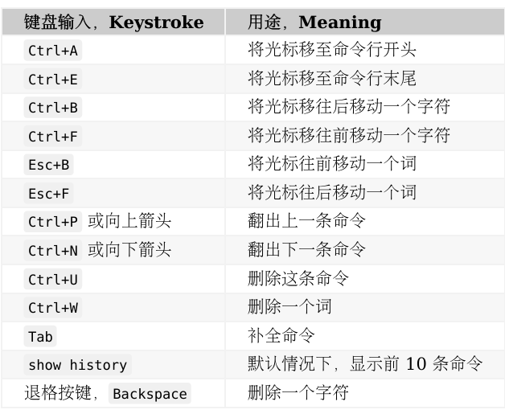
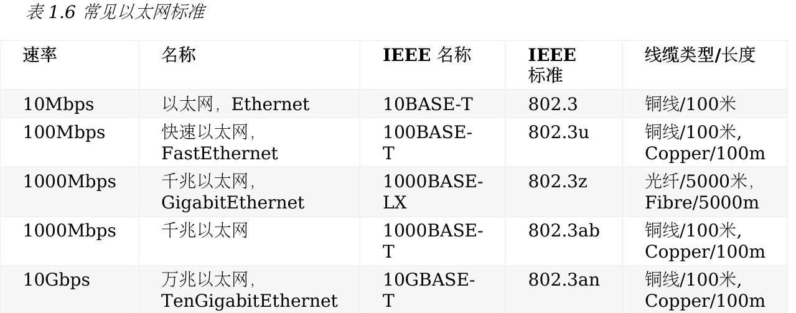

# CCNA筆記
由[60天通过思科认证的网络工程师考试](https://github.com/gnu4cn/ccna60d)整理後編寫的自我筆記  
  
# 目錄
[Day1_網路、線纜、OSI、TCP 模型](https://github.com/passionju/CCNA_Mandarin/blob/main/Day1_%E7%B6%B2%E8%B7%AF%E3%80%81%E7%B7%9A%E7%BA%9C%E3%80%81OSI%E3%80%81TCP%20%E6%A8%A1%E5%9E%8B/day1.md)

# 快捷指令
  

