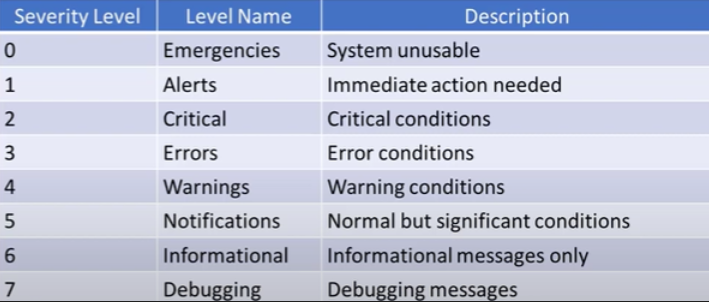
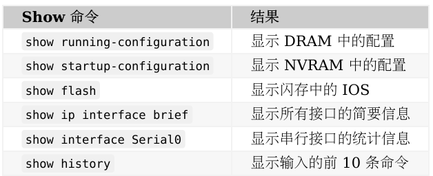

# 個人題庫總筆記  
+ [個人題庫總筆記](https://github.com/passionju/CCNA_Mandarin/blob/main/%E5%80%8B%E4%BA%BA%E9%A1%8C%E5%BA%AB%E7%AD%86%E8%A8%98/%E7%AD%86%E8%A8%98.md)  

# CCNA題庫筆記  
+ [筆記1-50](https://github.com/passionju/CCNA_Mandarin/blob/main/CCNA%E9%A1%8C%E5%BA%AB%E7%AD%86%E8%A8%981-50/%E7%AD%86%E8%A8%981-50.md)  
+ [筆記51-100](https://github.com/passionju/CCNA_Mandarin/blob/main/CCNA%E9%A1%8C%E5%BA%AB%E7%AD%86%E8%A8%9851-100/%E7%AD%86%E8%A8%9851-100.md)  
+ [筆記101-200](https://github.com/passionju/CCNA_Mandarin/blob/main/CCNA%E9%A1%8C%E5%BA%AB%E7%AD%86%E8%A8%98101-200/%E7%AD%86%E8%A8%98101-200.md)  
+ [筆記201-300](https://github.com/passionju/CCNA_Mandarin/blob/main/CCNA%E9%A1%8C%E5%BA%AB%E7%AD%86%E8%A8%98201-300/201-300.md)  
+ [筆記301-400](https://github.com/passionju/CCNA_Mandarin/blob/main/CCNA%E9%A1%8C%E5%BA%AB%E7%AD%86%E8%A8%98301-400/301-400.md)  
+ [筆記401-500](https://github.com/passionju/CCNA_Mandarin/blob/main/CCNA%E9%A1%8C%E5%BA%AB%E7%AD%86%E8%A8%98401-500/401-500.md)  
+ [筆記501-610](https://github.com/passionju/CCNA_Mandarin/blob/main/CCNA%E9%A1%8C%E5%BA%AB%E7%AD%86%E8%A8%98501-600/501-600.md)  
+ [筆記611-700](https://github.com/passionju/CCNA_Mandarin/blob/main/CCNA%E9%A1%8C%E5%BA%AB%E7%AD%86%E8%A8%98611-700/611-700.md)  

# CCNA題庫筆記-2  
+ [CCNA題庫筆記700-800](https://github.com/passionju/CCNA-2/blob/main/CCNA%E9%A1%8C%E5%BA%AB%E7%AD%86%E8%A8%98700-800/700-800.md)    
+ [CCNA題庫筆記800-900](https://github.com/passionju/CCNA-2/blob/main/CCNA%E9%A1%8C%E5%BA%AB%E7%AD%86%E8%A8%98800-900/801-900.md)  
+ [CCNA題庫筆記900-970](https://github.com/passionju/CCNA-2/blob/main/CCNA%E9%A1%8C%E5%BA%AB%E7%AD%86%E8%A8%98900-1000/900-1000.md)  
----------------------------------------------

# CCNA筆記
由[60天通过思科认证的网络工程师考试](https://github.com/gnu4cn/ccna60d)整理後編寫的自我筆記  
  
## CCNA60天目錄(之後轉題庫)  
+ [Day1_網路、線纜、OSI、TCP 模型](https://github.com/passionju/CCNA_Mandarin/blob/main/Day1_%E7%B6%B2%E8%B7%AF%E3%80%81%E7%B7%9A%E7%BA%9C%E3%80%81OSI%E3%80%81TCP%20%E6%A8%A1%E5%9E%8B/day1.md)  

+ [Day2_CSMACD,交換與虛擬區域網](https://github.com/passionju/CCNA_Mandarin/blob/main/CCNA60%E5%A4%A9%E7%AD%86%E8%A8%98/Day2_CSMACD%2C%E4%BA%A4%E6%8F%9B%E8%88%87%E8%99%9B%E6%93%AC%E5%8D%80%E5%9F%9F%E7%B6%B2/Day2.md)

+ [DAY3_中繼、DTP 及 VLAN 間路由](https://github.com/passionju/CCNA_Mandarin/blob/main/CCNA60%E5%A4%A9%E7%AD%86%E8%A8%98/DAY3_%E4%B8%AD%E7%B9%BC%E3%80%81DTP%20%E5%8F%8A%20VLAN%20%E9%96%93%E8%B7%AF%E7%94%B1/day3.md)
[DAY4_路由器和交換器安全](https://github.com/passionju/CCNA_Mandarin/blob/main/CCNA60%E5%A4%A9%E7%AD%86%E8%A8%98/DAY4_%E8%B7%AF%E7%94%B1%E5%99%A8%E5%92%8C%E4%BA%A4%E6%8F%9B%E5%99%A8%E5%AE%89%E5%85%A8/day4.md)

# 特別重要東西  
  

# CCNA 200-301注意事項  
+ [注意事項](https://www.pmp360.net/zh-Hant/blogs/ccna_ccnp_exams_guide_hant.html)
+ [CCNA Exam Safeguard Offer](https://learningnetworkstore.cisco.com/cisco-study-bundles/ccna-exam-safeguard-offer/EX-SG-CCNA-027329.html)  

# 快捷指令
  

