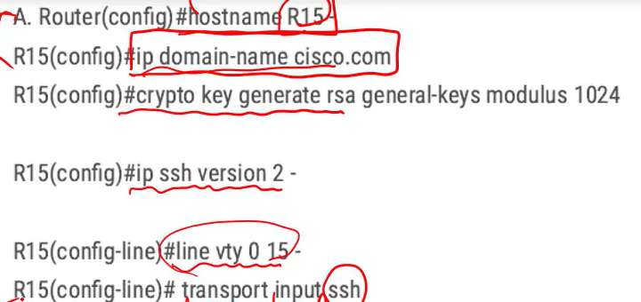

題目注意:  
123很長 
153學看ipconfig表  154 ,194,197,199(注意雖然我對),206有點問題,236,253,261,267計算,269,274,366,388,530dhcp解釋, 565,650,958解題技巧    
+ NAT是將內部ip轉成外部
+ SOHO network :    

小型網路
## TCP UDP  
### TCP:
+ FTP  
+ SMTP  
+ SSH  
+ DNS 63 port  
+ HTTP  
+ Telnet

用:
+ retransmission  (send transmission in sequence)
+ acknowledgment  
+ checksum
+ 使用32bit sequence number
沒有 
+ -parity check-
### UDP 
+ DHCP
+ SNMP  
+ TFTP  
+ DNS 63port  
+ RTP (VoIP)
用:
+ checksum  
+ 8 bit header  
+ higher transmission rate   

+ 適合語音傳輸

## HTTP Methods  
  

CRUD operation 對照 http method  :

## DHCP   
避免假造DHCP server  
1. client先發DHCP discover請求  
2. server就會給DHCP offer的回覆  
3. 如果接收的是untrust ,直接丟掉  
--->所以值會在DHCP或trunk所在的port去設**DHCP SNOOPING**   
<mark>**防止 man-in-the-middle spoofing 攻擊**</mark>  
---------------------
1. discover 是brasdcast,因為不知道在哪  
2. offer採用unicast,因為已知mac address  
3. client發出request 也是broadcast    
4. ACK也是UNICAST  

### DHCP Relay  
 如果 DHCP Server 與 DHCP Client 在不同一個網段，(中間可能有router)  
 Client的discover就送不到server了，這時候可以使用 DHCP Relay (或稱為 IP Helper)，  
 傳送DHCP Client的廣播變成unicast轉送到DHCP Server。  
 + 可節省DHCP server  
 + client interface是layer 3的  

 `ip helper-address 172.25.1.1 /*指定dhcp伺服器的地址`  

(https://blog.csdn.net/2301_76170756/article/details/134972747)

## SSH  
+ router hostname不能是預設值  
+ 要有ip domain name  
+ crypto key generate  

## DNS  
+ 讓application可以用名子而不是ip去辨識一些資源  
+ 一個名稱綁定多個ip位置  

## SNMP  
> 網管協定   
+ community string  

相同的community string 才會給通過  
只是用來當通關密碼  

+ getBulk一次獲取大量資料  
+ inform收到trap回一個ACK

## 三層式架構  
  

+ core:考慮到備援、高速傳送    
+ distuibution:layer3設備   
+ access :連接到終端設備  

看到"policy"就是distuibution layer  

## 兩層式架構 2-tier collapsed-core architecture  
小公司用，需要降低網路成本

## SDN controller-based networking 
>把data plane和control plane 分開  
用controller管理  
+ 透過northbound接收服務請求 , 傳送data給application   
 **REST 模型的API**  
+ 透過southbound管理底下設備device  
1. **透過OpenFlow部署**  
2. OpFlex---cisco的 
3. NETCONF  
4. CLI(Telnet/SSH)  
5. SNMP   

  

###  data plane:  
>主要一般user的處理  
傳輸資料給下一站  It forwards traffic to the next hop.  
"distributed"
### control plane   
>處理routing protocol ,維護routing table    
把他移到controller身上  
### manage plane  
>管理ROUTER，和AP有關的  
routing table 
提供 CLI access , CLI是Command Line Interface  

## configuration-management technology  
看到關鍵字:
### ansible  
+ YAML  
+ SSH,port22  
+ **Playbook** 裡面包含 **task** 

### Chef  
+ Ruby,JASON  
+ TCP 10002  
+ cookbook,recipe      

### Puppet 
+ manifest  
+ TCP 8140
+ 特徵 "=>"  

## JASON    
object是大括號{}    
array是中括號[]  

## IPv6簡寫規則：
+ 每組前面的0的可以省略不寫  
完整：2403:A200:A200:1100:0000:0000:0F00:0003  
簡寫：2403:A200:A200:1100:0000:0000:F00:3  

+ 連續為0的一組或多組，可以用 :: 代替，注意一個IP中只能用一次 ::  
完整：2403:A200:A200:1100:0000:0000:0F00:0003  
簡寫：2403:A200:A200:1100::F00:3  

+ 如果一組中全為0，又不想用 :: 代替，每組要保留1個0  
完整：2403:A200:A200:0000:AFFF:0000:0000:0003  
簡寫：2403:A200:A200:0:AFFF::3  

## IPv6 address 規則  
### Unicast
在IPv6裝置辨認介面  
unicast:1對1  

+ Global Unicast  
數字開頭 001
相當於合法public address  

+ Link-Local Unicast  
FE80::/10 ---->所以只有單一subnet  
只能有一個介面     
IPv6啟動會自動創地址  
當成下一站的ip位置(default gateway)
### Multicast  
FF開頭  
一對多的連接  
+ FF02::1 --->all node   
+ FF02::2 ----->all router    
###  Unique Local Address  ULA  
+ FC , FD 開頭  ---> FC00::/7   
+ private IPv6 addres  
+ internet上不能routing  
+ 可以同時在多個單位使用

### anycast 
>通常是Global Unicast

pc用同一個anycast ip但資料只傳給比較近的那台   
anycast:多部電腦用一個位置,但傳送時只有一個會收到(通常是最近的)

## switch 
### 交換方法   

+ frame flooding  
找不到目的地
+ frame filtering  
來源和目的地位在同一個port會過濾掉
 
+ frame forwarding  
+ frame switching   
有match 目的地   

### Configuration revision number  
會以版本號碼高的為主,這裡面switch都會以高的為主,新的進來若版本號碼高那原有的就會被覆蓋  

## 路徑選擇  
1. 遮罩長度  
2. A.D  
3. metric  

  

## floating static route 浮動route 
>會把管理距離A.D.設 **大** 一點,主要拿來當備用路徑  

## EIGRP  
>決定度量尺是靠Bandwidth + delay  

## private IPv4 address
+ 範圍:  
10.x.x.x   
172.16.x.x-172.31.x.x  
192.168.x.x  

## Hub-and-Spoke  
   

## negotiation protocol   
一邊被動另一邊就是主動  就會有trunk

### LACP  
>標準的  

MODE:   
+ active  
+ passive 

### LLDP  
在Global Configuration Mode
是CDP那類的

### PAgP
>cisco的

MODE:  
+ auto   
+ desirable

### CDP  
+ 在第二層運行
+ CISCO專屬  

## 2.4GHz nonoverlapping wireless channel  
channel 1,6,11是美國標準
  
## out of band
>透過使用網卡或專用管理口與伺服器連接，實現對伺服器的遠端管理與監控
+ service port  
+ console port  
## IPv6 DNS record type  

## RFC 1918  
>只能在內部使用一定要經過NAT出去 
 
## WIFI terms
  

+ ESS 是多台ap組合起來的服務  
+ IBSS 不需要有中間的ap   

## portfast
portfast是底下接接end device設的，不是交換器  
link up 之後直接接forwarding,跳過listening和learning  

  
ex:
  
可以用BPDU Guard避免收到BPDU會變err-disable

## AAA
+ Authentication: user identification    
+ Accounting:  user service  
+ Authorization: access control  

## RADIUS and TACACS+  
### RADIUS  
>弱,舊,就是AAA  
+ 一次合併做 Authentication 和 Authorization  
+ 只把password做加密  
+ 管理者可在AP上Authentication和configuration   
### TACACS+ 
>強 
+ 分開執行 Authentication 和 Authorization   
+ 管理者可在AP上Authentication和configuration  
+ 整個加密

## autonomous AP  
+ 可透過Telnet,SSH 或 web GUI管理    
+ 需要一個管理用的IP address   

## cloud-baseed AP  
+ Web-based dashboard 管理  
+ 自動部署  

## lightweight  
lightweight--AP要和**controller**用CAPWAP溝通,AP要設定  
+ WLC配置與管理  
+ 支援好幾種運營模式  

## LAG  
Link Aggregation 
>好幾條電路邏輯上變成一條,和ethernet一樣
相當於Ethernet channel  
## default vlan  
有1和 1002-1005的  

## 介面連不上的可能  down/down  ,L1/L2
+ speed mismatch  
+ error-disabled  
+ ex: shut down  
他是administrative down/down  

## FHRP  
>包含HSRP,VRRP,GLBP

## HSRP  
CISCO的 HSRP主要是layer3 default gateway的備援在**virtual router**   
LAYER3 都會先比PRIORITY在比ip address  

## VRRP 
> 標準的,third-party用的  

## UTP CAT    

# ROUTER  

## traffic-control   

### Shaping: 
>把超過的部分buffer排程到後面去  
 Delay packets by hold them in a queue.
### Policing:
>把超出的部分drop掉  
+ dropping  
+ remarking  
### marking: 
>change the value of the TOS field in the IPv4 packet header  

## 封包傳送機制  

+ ISATAP主要是為了IPv6與IPv4之間傳送的問題,不是為了加密  
+ IPsec有加密功能,但是沒有multicast功能   
+ GRE不加密但可以multicast  

## IPsec mode   
+ transport mode:只針對data加密  
+ tunnel mode:原始ip封包整個加密,用ESP  

## OSPF  
+ 支援vlsm  
+ 控制網路不穩定網路不穩定linkup linkdown就會重新計算最短路徑  
+ 允許額外進階的routing update  
   

### interface的狀態  

## HSRP  
一個active , 一個standby(備用的),其他是listen

## VRRP  
用於多廠牌環境  
當有成員fail時,維持正常流程,ARP快取也不用改變,因為他存的是virtual router的virtual MAC ,設備fail換上新的補上原本的虛擬MAC就好   

## FHRPs  
>做default gateway的備援
+ 當有問題可自動切換default gateway,防止default gateway failure    
+ 允許多裝置當成單一虛擬gateway
  

## 網路協定  
### 802.11r  
> fast transition  

### 802.11w   
>透過保護management frame 交換去加強WI-FI網路

### Rapid PVST+ 
>和標準的RSTP類似,但這是CISCO的 
+ 只有一個路徑  
+ 每一個VLAN創造一個spanning-tree     

### 802.11a 
5Ghz
### 802.11b  
2.4Ghz
### 802.11g
2.4Ghz  
### 802.11n  
2.4/5 Ghz
## syslog 嚴重等級  

## QoS tools     

## NTP  
+ 時間校正資訊外面包著UDP port123 ,外面再包IP 與第二層frame  
+ 可以同時擔任NTP sever 與client  

## WEP,WPA,WPA2,WPA3  
+ WEP:RC4  
+ WPA:TKIP 
+ WPA2:802.1x   
有用CBC-MAC = CCMP   
+ WPA3:SAE  
Personal有用CBC-MAC = CCMP 128   
Enterprise有用CBC-MAC = CCMP 256  

## WLAN with WPA2 PSK is configured in the Wireless LAN Controller GUI

  
### ASCII  
+ AES至少需要8字元  
+ TKIP 至少需要12字元  

### HEX  
+ 64字元  

## Cisco DNA Center  
好處:Automation和Programmability自動化和可編程性  
+ Controller-based  
+ 加device會放入Managed state  
+ 和指派進Global state  
+ 模組化設計為了管理不同網路要求  

## 惡意攻擊  
### vlan hopping
>預設每個port都在DTP auto之下,攻擊者讓該port認知是一個trunk  
各個valn流量就會跑到那,獲得資料  

----><mark>可以DTP關閉</mark>,nonegotiate,port shut down ,直接設定trunk`switch port mode`,所有port指定到某vlan不要用native vlan      
  
### man-in-the-middle spoofing  
<mark>設定DHCP snooping</mark>  

### double-tagging  
>ethernet 內插入兩個802.1q tag(原本只有一個),前一個故意是native vlan,  
所以機器會以為不用加tag,但裡面其實還有一個tag,就以為要往那個vlan去。    
<mark>把native vlan設定承不是預設vlan</mark>
## 簡單但要記

## hypervisor  
+ 當VM和實體資源之間的介面  

## technology type  

### orchestration  
+ 在雲端上做自動化處理  
+ Ansible
### Configuration Management  
+ Puppet

## Flexconnect 
+ 只要提到AP不需要controller   
+ 或是controller故障AP仍可以正常運作  

